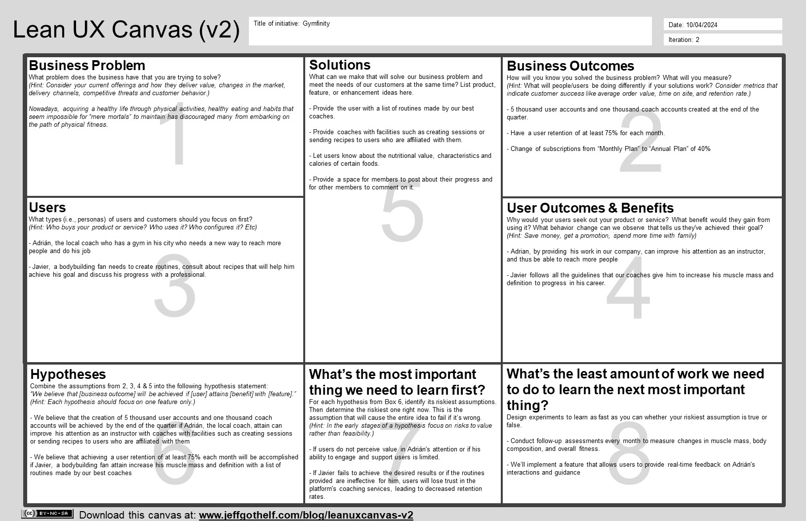

# **Capítulo I: Introducción**
La introducción es fundamental para establecer el marco en el que se desarrollará el proyecto. Proporcionará una visión general de los objetivos, los antecedentes y el alcance del trabajo. Además, ayuda a contextualizar la importancia del proyecto, enfatizando sus motivaciones y los problemas que busca resolver.
## 1.1. Startup Profile
Es fundamental conocer el perfil de una startup para comprender su visión, valores fundamentales y propuesta única en el mercado. En este momento, hablaremos sobre las cosas que definen la identidad y el potencial de una startup, desde su historia hasta su enfoque innovador y sus objetivos.
### 1.1.1. Descripción de la Startup

Somos una compañía recién creada llamada "Health&Fit" que tiene una misión en mente: <b>mejorar la salud de todos nuestros miembros mediante ayuda personalizada</b>.
 Por esta razón, nos reunimos y trabajamos con cooperación, eficiencia y responsabilidad para crear "FlexApp". Los integrantes que conforman este equipo son:

### 1.1.2. Perfiles de integrantes del equipo

|                                               |                                                                                                                                                                                                                                                                                                                                                                                                                                                                                                                                                  |
|-----------------------------------------------|--------------------------------------------------------------------------------------------------------------------------------------------------------------------------------------------------------------------------------------------------------------------------------------------------------------------------------------------------------------------------------------------------------------------------------------------------------------------------------------------------------------------------------------------------|
|  |  |
|  |                                                                                                                                                                                              |
| |                       Mi nombre es **Renato German Reyes Valenzuela** y tengo 23 años. Soy estudiante de la carrera de ingeniería de software de la UPC (Universidad Peruana de Ciencias Aplicadas). Estoy en el sexto ciclo de mi carrera. Gracias a los cursos que estuve llevando los últimos ciclos, más el aprendizaje extracurricular, cuento con la capacidad y conocimientos para desarrollarme correctamente con los avances y desarrollo de la propuesta de trabajo que ofrecemos. Por último, destaco mi capacidad de empatía y compañerismo para poder avancar de manera grupal los sprint correspondientes y apoyarme en lo necesario con mis compañeros. |
|  | Mi nombre es **Jessica Elizabeth Comettant Rubiños** y tengo 20 años. Soy estudiante de la carrera de ingeniería de software de la UPC (Universidad Peruana de Ciencias Aplicadas). Estoy en el sexto ciclo de mi carrera. Gracias a las asignaturas correspondientes a la malla curricular de mi carrera, cuento con las habilidades intelectuales propicias para el desarrollo del proyecto. Asimismo, mi personalidad se encuentra basada en la autonomía. Por lo tanto, he sido capaz de extender mis conocimientos de programación con mayor material de estudio. Finalmente, destaco de mi personalidad la empatía, la responsabilidad, la amabilidad y la capacidad de trabajar en equipo.        |
| | Soy estudiante de 6to ciclo en la Universidad Peruana de Ciencias Aplicadas, tengo conocimientos en lenguajes de programación como C++, C#, Python, HTML, Java, MySQL. Lo cual podré beneficiar en el progreso de nuestro trabajo de curso.   |   
|  | Soy estudiante de Ingeniería de Software en la Universidad Peruana de Ciencias Aplicadas (UPC), con conocimientos en lenguajes de programación como C++ y Python. Además, manejo herramientas que apoyan el desarrollo eficiente de proyectos de software. Siempre me esfuerzo por adquirir nuevas habilidades y mejorar mis competencias técnicas para afrontar los desafíos del desarrollo de software. Me considero una persona responsable, comprometida y enfocada en la calidad del trabajo. Tengo la capacidad de adaptarme rápidamente a nuevas tecnologías y entornos. Cumplo con los plazos establecidos y tengo una gran disposición para aprender y colaborar en equipo. Estoy seguro de que mi actitud proactiva me permitirá aportar de manera significativa al equipo. |   

## 1.2. Solution Profile
Health&Fit creó FlexApp, una aplicación web completa para entusiastas del fitness y profesionales. ofrece un modelo de suscripción que permite a los miembros acceder a planes de nutrición personalizados, entrenadores especializados y rutinas de ejercicio adaptadas. FitHub quiere revolucionar la industria del fitness combinando tecnología con soluciones de fitness personalizadas.

**Características Principales:**

- **Planes de Nutrición Personalizados:** FlexApp utiliza algoritmos avanzados para generar planes de nutrición personalizados según las preferencias del miembro, restricciones dietéticas y objetivos de fitness. Los miembros pueden acceder a una amplia gama de opciones de comidas adaptadas a sus necesidades específicas, asegurando una dieta equilibrada y saludable.

- **Entrenadores Expertos:** FlexApp conecta a los miembros con entrenadores de fitness certificados que se especializan en áreas como entrenamiento de fuerza, cardio, yoga, etc. Los miembros pueden programar sesiones de entrenamiento virtuales, recibir comentarios personalizados y realizar un seguimiento de su progreso con el tiempo.

- **Rutinas de Ejercicio Adaptadas:** FlexApp ofrece una amplia biblioteca de rutinas de ejercicio adaptadas para miembros de todos los niveles de fitness y preferencias. Ya sea que los miembros prefieran entrenamientos de alta intensidad, levantamiento de pesas o yoga, pueden encontrar rutinas adecuadas diseñadas para lograr los resultados deseados.

- **Seguimiento del Progreso:** FlexApp permite a los miembros realizar un seguimiento de su progreso fitness con informes detallados, incluyendo métricas como pérdida de peso, ganancia muscular y mejora del rendimiento general. Esta función permite a los miembros mantenerse motivados y monitorear su éxito con el tiempo.

### 1.2.1 Antecedentes y problemática
Los antecedentes y la problemática proporcionan el contexto y la base sobre la cual se desarrolla un proyecto. Los antecedentes suelen incluir información histórica, investigaciones previas y datos relevantes que conducen al reconocimiento de un problema o necesidad. La problemática describe los desafíos o dificultades específicas que enfrenta una situación o un grupo de personas, lo cual justifica la necesidad de una intervención o solución.
#### Uso de la técnica  The 5'W's w Y 2'H's
Presentación del modelo de las preguntas 5Ws y 2 hs con la que se analizaron los antecedentes y la problemática que abarca nuestro proyecto.

| LAS 5W y 2H | Pregunta                                                | Descripción                                                                                                                                                                                                                                                                                                                                                                                                                                                                                                                                                                                                                                                                                                                                                                                      |
|-------------|---------------------------------------------------------|--------------------------------------------------------------------------------------------------------------------------------------------------------------------------------------------------------------------------------------------------------------------------------------------------------------------------------------------------------------------------------------------------------------------------------------------------------------------------------------------------------------------------------------------------------------------------------------------------------------------------------------------------------------------------------------------------------------------------------------------------------------------------------------------------|
| Who?        | ¿Quién es afectado?                                     | Personas que buscan mejorar su salud y condición física, así como coaches en temas como el ejercicio y la nutrición.                                                                                                                                                                                                                                                                                                                                                                                                                                                                                                                                                                                                                                                    |
| What?       | ¿Cuál es el problema?                                   | La desmotivación o los obstáculos que enfrentan las personas al planificar y comenzar una rutina de ejercicio, ya sea por motivos de salud o actividad propia. Según el Ministerio de Salud (MINSA, 2024), el 62% de los peruanos mayores de 15 años tiene obesidad, lo que demuestra que la población carece de disciplina, compromisos o malos hábitos de alimentación.                                                                                                                                                                                                                                                                                                                                                                                                                        |
| When?       | ¿Cuándo sucede el problema?                             | Es un problema que muchas personas han tenido desde que intentaron comenzar una rutina de entrenamiento con el objetivo de satisfacer sus necesidades y mejorar su estilo de vida. Incluyendo además a los coaches que han deseado aumentar su clientela.                                                                                                                                                                                                                                                                                                                                                                                                                                                                                           |
| Where?      | ¿Dónde surge el problema?                               | La aplicación estará disponible en línea, lo que permite el acceso desde cualquier lugar con conexión a Internet, ya que el problema surge de las necesidades y ubicación de la persona, siendo los principales factores la distancia del gimnasio más cercano y sus tiempos disponibles.                                                                                                                                                                                                                                                                                                                                                                                                                                                                                           |
| Why?        | ¿Cuál es la causa del problema?                         | La falta de orientación personalizada para las personas que desean mejorar su salud y condición física, así como la necesidad de los profesionales del coaching de llegar a nuevos clientes y brindarles un servicio efectivo y personalizado, llevó a la creación de la aplicación.                                                                                                                                                                                                                                                                                                                                                                                                                                                                                                            |
| How?        | ¿Qué llevó a la persona a esta situación?               | Según un estudio de Ipsos, el 44 % de las personas hacen actividad física con frecuencia y el 88 % cree que tener una buena alimentación es esencial para tener una vida saludable (Ipsos Perú, 2019). Por lo tanto, nuestra aplicación permitirá que los miembros y los coaches se comuniquen directamente a través de reuniones virtuales y les brinde acceso a planes alimentarios personalizados. Para acceder a estos servicios y recibir el seguimiento y el apoyo continuo que necesitan para alcanzar sus objetivos de salud, los miembros podrán suscribirse mensualmente.                                                                                                                                                                                    |
| How Much?   | ¿Cuál es la cantidad, duración o intensidad del evento? | Un estudio de Fitness Pass (2019) encontró que el 80% de las personas cancelan su membresía en el gimnasio después de tres meses. Este hallazgo preocupa a la industria del fitness, donde la mayoría de las personas parecen encontrar difícil seguir un régimen de ejercicio a largo plazo. La desmotivación y la falta de tiempo son los principales impulsores de esta decisión. La falta de motivación puede provenir de una variedad de fuentes, como la falta de resultados rápidos o visibles. Además, las demandas de tiempo suelen ser un factor importante en el mundo moderno porque las personas luchan por equilibrar el trabajo, la familia y otras responsabilidades. |

### 1.2.2 Lean UX Process
El proceso Lean UX es una metodología ágil que revoluciona la forma en que se diseña y desarrolla productos digitales. En este punto, exploraremos los principios fundamentales de Lean UX y cómo se integran en el ciclo de desarrollo de productos. Desde la colaboración multidisciplinaria hasta la iteración rápida y la validación continua, descubriremos cómo este enfoque permite a los equipos crear productos centrados en el usuario de manera eficiente y efectiva.

- #### 1.2.2.1. Lean UX Problem Statements
"En un contexto de creciente interés por el bienestar personal, se hace evidente la necesidad de una aplicación web de coaching que facilite la conexión entre miembros y profesionales del ejercicio y nutrición. Dicha aplicación web debe proporcionar una experiencia personalizada y efectiva para cada individuo, adaptándose a sus necesidades y objetivos específicos."   
Como grupo, nos comprometeremos a resolver este problema trabajando juntos entre los miembros que deseen comenzar una rutina de ejercicio, así como con profesiones en coaching y nutrición. Utilizando esta información, diseñaremos y desarrollaremos una solución innovadora que satisfaga completamente las necesidades y expectativas de nuestros miembros.

- #### 1.2.2.2. Lean UX Assumptions
  
  ### **Business Assumptions**

    * **I believe my customers need** personalized guidance and continuous support to achieve their health and fitness goals.
    * **These demands can be met by** an online platform that connects members with professional coaches in exercise and nutrition, offering direct communication and personalized plans.
    * **The initial customers will be** those who are actively seeking to improve their lifestyle and are willing to invest in professional coaching services to achieve it.
    * **The primary need that customers have for my service is** to receive expert guidance and personalized follow-up to optimize their progress and effectively and sustainably achieve their health goals.
    * **I will acquire most of my customers through** digital marketing strategies targeted at individuals interested in health and wellness, as well as collaborations with influencers and industry professionals.
    * **I will generate revenue through** a monthly subscription model, where members will pay for access to coaching services and personalized meal plans offered.
    * **The main problem that could affect my product is** competition in the health and wellness app market, which could hinder customer acquisition and retention in a saturated market.
    * **We will address this situation by** clearly differentiating our service, highlighting the quality of personalized attention and the effectiveness of our exercise and nutrition plans, as well as implementing customer retention strategies to ensure long-term satisfaction.

  ### **Business Outcomes Assumptions**
    * Improving the user experience of our web app will lead to an increase in membership sign-ups and revenue for gyms.
    * Providing personalized coaching services will result in higher member engagement and retention rates.
    * Offering adaptable and convenient meal plans will enhance member satisfaction and loyalty to the platform.
    * Ensuring the security and confidentiality of member data will build trust and credibility in the online community.
    * Developing an intuitive and user-friendly interface will lead to higher user engagement and usage frequency.
    * Implementing effective marketing strategies will drive customer acquisition and growth for the business.
    * Differentiating our service from competitors will establish a unique value proposition and attract a broader audience.
    * Building a strong online community will foster member engagement, support, and loyalty to the platform.
  
  ### **User Assumptions**
    * Target Member Segment:
      * Members are seeking a comprehensive solution that not only provides guidance in exercise but also in nutrition, recognizing the importance of both aspects in achieving their health goals.
      * Members highly value convenience and accessibility in an online coaching platform, preferring the flexibility of being able to access services from anywhere and at any time.
      * Members are willing to invest in a professional coaching service that offers direct and personalized communication with a coach, feeling more motivated and committed to their progress when they receive individualized support.
      * Members expect the meal plans provided by the platform to be adaptable to their dietary preferences and restrictions, as well as easy to follow and integrate into their daily lives.
      * Members value transparency and reliability in an online coaching platform, seeking assurances that their personal and health data will be treated securely and confidentially.
    * Target Coach Segment:
      * Coaches seek a platform that allows them to reach a broader and more diverse audience, offering their services efficiently and effectively through an online environment.
      * Coaches value the opportunity to establish direct and personalized communication with their clients, enabling them to tailor their services and plans to the specific needs and goals of each individual.
      * Coaches are interested in a platform that provides them with tools and resources to optimize their work, including the ability to schedule sessions, track member progress, and access detailed reports and analysis.
      * Coaches seek a platform that offers an intuitive and user-friendly experience, allowing them to navigate smoothly and quickly access the information and features they need to provide high-quality service to their clients.
      * Coaches value security and confidentiality in an online coaching platform, expecting their data and their clients' information to be protected and for the platform to comply with industry-established privacy and security standards.

  ### **User Outcomes Assumptions**
  * Target Member Segment:
      * Members will experience increased motivation and commitment to their health and fitness progress by receiving personalized guidance and continuous support from a professional coach.
      * Members will feel satisfied and content with the personalized and adaptable meal plans provided by the platform, finding options that fit their dietary preferences and restrictions.
      * Members will trust in the security and confidentiality of their personal and health data on the platform, feeling comfortable and protected when sharing sensitive information with their coaches and the online community.
      * Members will enjoy an intuitive and user-friendly experience on the online coaching platform, allowing them to navigate smoothly and quickly access the resources and services they need to optimize their progress and achieve their health goals.   * Segmento objetivo Coach:
  * Target coach Segment:
      * Coaches will find the platform easy to use and efficient in delivering personalized guidance and support to their clients.
      * Coaches will appreciate the ability to customize meal plans and fitness routines for individual clients, enhancing their coaching effectiveness.
      * Coaches will trust in the platform's security measures to safeguard client data and maintain confidentiality, ensuring a professional and ethical coaching environment.
      * Coaches will benefit from a streamlined interface and tools that facilitate communication and collaboration with clients, enabling them to focus more on providing value and less on administrative tasks.

- #### 1.2.2.3. Lean UX Hypothesis Statements

  * If we offer members convenient and flexible access to online coaching services, enabling direct communication with coaches and personalized plans, then the probability of members committing long-term to the platform will increase, resulting in higher customer retention.
  * If we provide personalized and adaptable meal plans that cater to members' dietary preferences and restrictions, then member satisfaction will increase, along with the likelihood of them staying on the platform, contributing to business growth through referrals and positive recommendations.
  * If we guarantee the security and confidentiality of members' personal and health data, and provide a transparent and reliable member experience, then trust and loyalty towards the platform will increase, resulting in higher retention and a positive reputation in the market.
  * If we develop an intuitive and easy-to-use member interface on the online coaching platform, allowing members to navigate seamlessly and access resources and services quickly, then participation and frequency of use will increase, leading to higher customer retention and business growth.

- #### 1.2.2.4. Lean UX Canvas
El Lean UX Canvas es una herramienta  que permite a los equipos plasmar y visualizar de manera concisa los aspectos clave de su proyecto. En este punto, exploraremos cómo el Canvas facilita la colaboración y la alineación del equipo al definir claramente el problema, la solución propuesta, los usuarios y sus necesidades, así como las métricas de éxito.
  

## 1.3. Segmentos objetivo.
Los segmentos objetivo son grupos específicos de usuarios a los que se dirige un producto o servicio en particular.    
Los segmentos objetivos identificados se definirán en la siguiente tabla:

| Segmento Objetivo                                                                                                                                    |                                                              Características Demográficas                                                              |                                                                                                                                                                                                                                                                                                                                    Información estadística de sustento |
|:-----------------------------------------------------------------------------------------------------------------------------------------------------|:------------------------------------------------------------------------------------------------------------------------------------------------------:|-----------------------------------------------------------------------------------------------------------------------------------------------------------------------------------------------------------------------------------------------------------------------------------------------------------------------------------------------------------------------:|
| Miembro: Personas que buscan bienestar físico mediante comida saludable y rutinas de ejercicio que cuentan con una subscripción.                     | Edad: 18 años a más.   Género: Varía (Hombre y Mujer).  Sistemas operativos: Windows y MACos   Ubicación Geográfica: Urbanos y suburbanos. | Según Calderón Gamarra (2021; ___Hábitos alimentarios, estado nutricional y obesidad central en pacientes adultos mayores hipertensos y diabéticos de un centro de salud___, Junín, Perú 2020) “el Instituto Nacional de Salud (INS) a través del Centro Nacional de Nutrición (CENAN) 10 señaló que tanto la obesidad y sobrepeso alcanzaron un 70% en la población.” |
| Coach: Entrenadores personales certificados o coaches con experiencia en la industria del fitness que ejercen su trabajo dentro de nuestra compañía. | Edad: 25 años a más.  Género: Varía (Hombre y Mujer).  Sistemas operativos: Windows y MACos   Ubicación Geográfica: Urbanos y suburbanos.  |      Como menciona Mario Morante (___Últimas Tendencias en la Industria de Entrenamiento Personal___; ) “Desarrollos recientes han hecho que los programas de certificación sean más asequibles y accesibles, lo que ha llevado a un crecimiento en el número de entusiastas del fitness que cumplen su sueño de convertirse en entrenadores personales certificados.” |
