# Capítulo IV: Product Design
El product design será fundamental para nuestro trabajo, ya que nos permitirá crear soluciones centradas en el usuario que aborden de manera efectiva los desafíos identificados. Utilizaremos este enfoque para diseñar productos y servicios que sean intuitivos, atractivos y que cumplan con las expectativas y necesidades de nuestros usuarios. Esto nos ayudará a generar valor para nuestros clientes y a alcanzar nuestros objetivos comerciales de manera más eficiente.
## 4.1. Style Guidelines.
Un **Style Guideline** es un conjunto de reglas y normas que definen cómo se debe redactar, diseñar o presentar documentos, contenido web, software u otros trabajos creativos. A continuación, se detallan las especificaciones de los parámetros implementados en la estructura del proyecto.
### 4.1.1. General Style Guidelines
**Branding** 
Para la creación del logo de nuestro producto FlexPal, se ha optado por un diseño moderno y minimalista que refleje las intenciones de la aplicación. El logotipo se compone de una tipografía elegante y sencilla, acompañada de un icono que simboliza la flexibilidad y ejercicio, asi como también una frase alentadora. Los colores utilizados son vibrantes y energéticos, lo que refuerza la idea de un estilo de vida activo y saludable. En cuanto a la paleta de colores, se ha elegido una combinación de tonos azules y blancos que transmiten calma y frescura. 
  
**Typography** 
Para la tipografía de FlexPal, se ha seleccionado una fuente moderna y legible que se adapta a la estética general del producto. La tipografía principal es **Montserrat**, una fuente sans-serif que es fácil de leer en pantallas digitales y que aporta un aspecto limpio y contemporáneo al diseño. Para los encabezados y títulos, se ha optado por la fuente **Roboto**, que es más audaz y llamativa, lo que permite destacar la información importante y captar la atención del usuario.  
  A continuación, se presentan las tipografías seleccionadas para FlexPal:
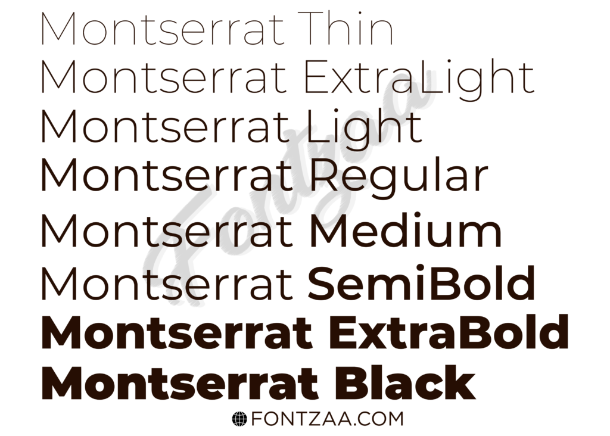  
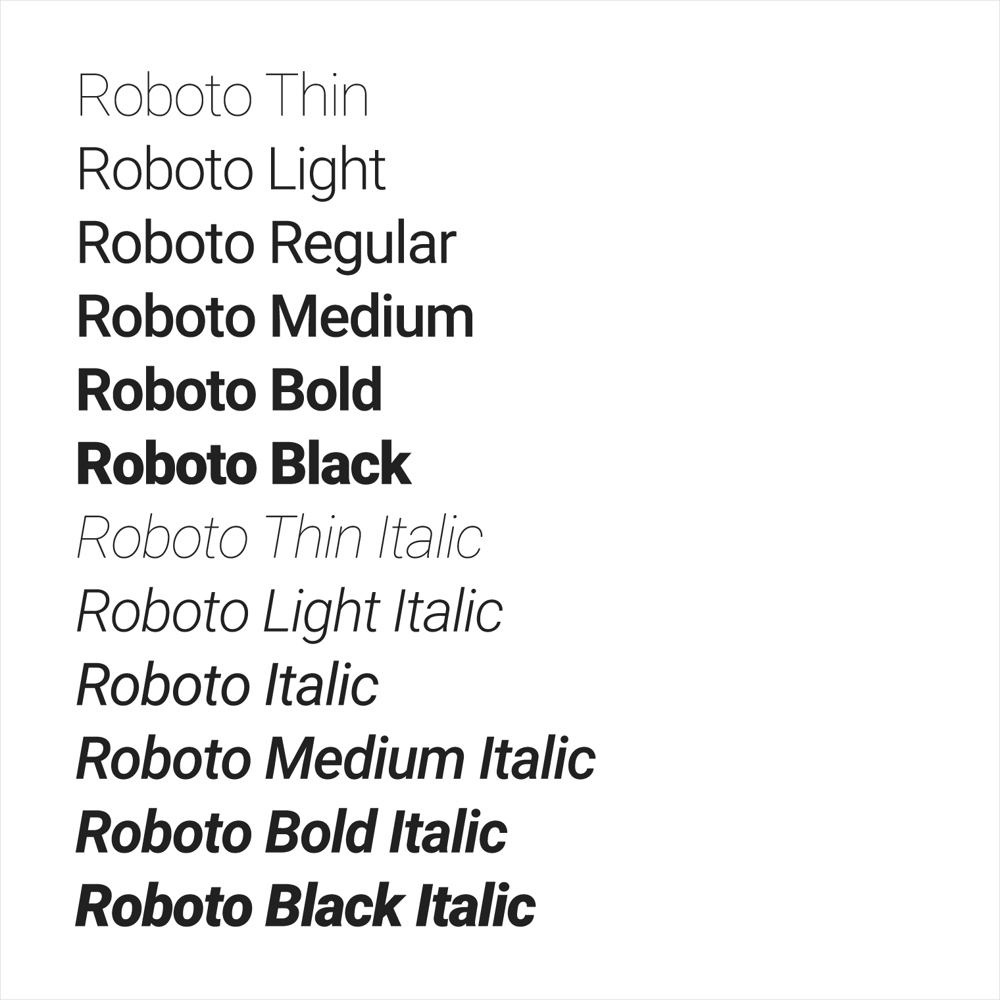  
**Colors** 
La paleta de colores de FlexPal se compone de tonos que reflejan la frescura, la calma y la energía asociadas con un estilo de vida activo y saludable. Los colores elegidos son vibrantes y atractivos, lo que ayuda a captar la atención del usuario y a transmitir la idea de un producto moderno y dinámico. A continuación, se presentan los colores seleccionados para FlexPal:
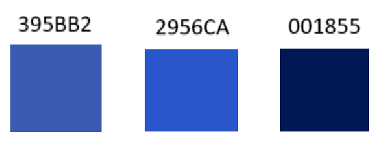  
  
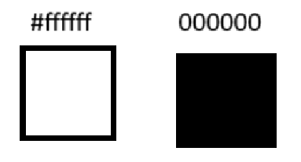  

**Spacing** 
El espaciado es un elemento clave en el diseño de FlexPal, ya que ayuda a organizar y estructurar la información de manera clara y coherente. Se ha optado por un espaciado generoso entre los elementos de la interfaz, lo que facilita la lectura y la navegación del usuario. Además, se ha utilizado un espaciado uniforme en todo el diseño, lo que crea una sensación de equilibrio y armonía en la composición.  
  
### 4.1.2. Web Style Guidelines
<td>Para FlexPal, estamos planeando desarrollar una plataforma web. Por lo tanto, implementaremos un diseño adaptable (conocido como Web Responsive Design) con el objetivo de optimizar la presentación de información en cualquier dispositivo. Esto asegurará que el contenido se mantenga intacto y, en última instancia, mejorará la experiencia del usuario.</td>
  
<td>Como equipo, hemos optado por **incorporar el patrón de diseño en forma de Z en nuestro sitio web. Esta técnica de diseño web es altamente efectiva para **mejorar la experiencia del usuario, ya que guía su atención hacia los elementos clave y potencia la eficacia del contenido en la página. Por lo general, colocamos el logotipo en la esquina superior izquierda, asegurándonos de que sea lo primero que llame la atención del usuario. Justo enfrente, en la esquina superior derecha, ubicamos la barra de navegación, acompañada de un llamado a la acción destacado.</td>

## 4.2. Information Architecture
<td>Esta sección se basa principalmente del contenido visual, los estilos, los tags y más que se tomarán en cuenta para nuestra web y landing page de AquilaFacil. Se verá los tópicos de Organization Systems, Labeling Systemes, SEO and Meta Tags y Searching y Navigation Systems.</td>

### 4.2.1. Organization Systems
**Menú Principal**
<table style="text-align:center">
    <thead>
        <tr>
            <th style="text-align:center">Tópico</th>
            <th style="text-align:center">Definición</th>
        </tr>
    </thead>
    <body>
        <tr>
            <td>Home</td>
            <td style="text-align: left">La página de inicio puede mostrar una vista general del servicio y destacar las características clave.</td>
        </tr>
        <tr>
            <td>Suscriptions</td>
            <td style="text-align: left">La página que ofrece los planes de suscripción para beneficios específicos con diferentes costos para cualquier tipo de presupuesto.</td>
        </tr>
        <tr>
            <td>Testimonials</td>
            <td style="text-align: left">La página que ofrece a la los usuarios comentarios y calificaciones sobre el servicio.</td>
        </tr>
        <tr>
            <td>Contact</td>
            <td style="text-align: left">La página que ofrece la manera más eficiente en caso de el usuario tener alguna duda o querer compartir algo con nosotros.</td>
        </tr>
        <tr>
            <td>Log In</td>
            <td style="text-align: left">La página para que el usuario ingrese a su sesión. En caso de no tener sesión hay una sección para poder registrarse gratis al servicio web.</td>
        </tr>
    </body>
</table>
  

**Página de Suscriptions**
<table style="text-align:center">
    <thead>
        <tr>
            <th style="text-align:center">Tópico</th>
            <th style="text-align:center">Definición</th>
        </tr>
    </thead>
    <body>
        <tr>
            <td>Lista de planes de suscripción</td>
            <td style="text-align: left">La página mostrará todos los planes que ofrece el servicio.</td>
        </tr>
        <tr>
            <td>Detalles de planes</td>
            <td style="text-align: left">La página mostrará los detalles de todos los planes que ofrece el servicio.</td>
        </tr>
    </body>
</table>
  

**Página de Testimonials**
<table style="text-align:center">
    <thead>
        <tr>
            <th style="text-align:center">Tópico</th>
            <th style="text-align:center">Definición</th>
        </tr>
    </thead>
    <body>
        <tr>
            <td>Lista de testimonios</td>
            <td style="text-align: left">La página mostrará todos lod títulos de los 10 primeros testimonios dados por otros usuarios.</td>
        </tr>
        <tr>
            <td>Detalles de planes</td>
            <td style="text-align: left">La página mostrará con mayor detalle todos los comentarios dejados por los usuarios.</td>
        </tr>
    </body>
</table>
  

**Página de Contact:** <td>Proporciona información de contacto y formularios para consultas</td>
  

**Página de Log In**
<table style="text-align:center">
    <thead>
        <tr>
            <th style="text-align:center">Tópico</th>
            <th style="text-align:center">Definición</th>
        </tr>
    </thead>
    <body>
        <tr>
            <td>Registro y autenticación</td>
            <td style="text-align: left">La página de inicio puede mostrar una vista general del servicio y destacar las características clave.</td>
        </tr>
    </body>
</table>

 

**Otras páginas y funciones**
<table style="text-align:center">
    <thead>
        <tr>
            <th style="text-align:center">Tópico</th>
            <th style="text-align:center">Definición</th>
        </tr>
    </thead>
    <body>
        <tr>
            <td>Perfil de usuario</td>
            <td style="text-align: left">Permite a los usuarios gestionar su perfil y la información personal.</td>
        </tr>
        <tr>
            <td>Configuraciones</td>
            <td style="text-align: left">Permite a los usuarios y técnicos configurar sus preferencias.</td>
        </tr>
        <tr>
            <td>Pagina acerca de nosotros</td>
            <td style="text-align: left">Información sobre la empresa o la aplicación.</td>
        </tr>
        <tr>
            <td>Ayuda y soporte</td>
            <td style="text-align: left">Recursos de ayuda, preguntas frecuentes y opciones de asistencia.</td>
        </tr>
    </body>
</table>

**Barra de navegación:** <td>Una barra de navegación clara y consistente en la parte superior de cada página facilita la navegación entre las secciones principales de la aplicación.</td>

**Responsive design:** <td>La aplicación debe ser fácil de usar tanto en dispositivos de escritorio como en dispositivos móviles, adaptando la interfaz de usuario según
el tamaño de la pantalla.</td>

### 4.2.2. Labeling Systems
<td>Para los sistemas de etiquetado, hemos optado por organizar el contenido mediante encabezados que agrupen las secciones a las que el usuario puede acceder. De esta manera, el usuario sabe dónde hacer clic para acceder a las secciones correspondientes.</td>

<table style="text-align:center">
    <thead>
        <tr>
            <th style="text-align:center">Tópico</th>
            <th style="text-align:center">Definición</th>
        </tr>
    </thead>
    <body>
        <tr>
            <td>Home</td>
            <td style="text-align: left">Sección principal a la cual llegará el usuario al entrar al link de la aplicación web.</td>
        </tr>
        <tr>
            <td>Suscriptions</td>
            <td style="text-align: left">En esta sección, se podrán ver los planes y tarifas disponibles con los cuales contamos.</td>
        </tr>
        <tr>
            <td>Testimonios</td>
            <td style="text-align: left">Aquí los clientes pondrán sus reseñas y comentarios acerca del servicio que se les brindó.</td>
        </tr>
        <tr>
            <td>Contacto</td>
            <td style="text-align: left">Esta es la sección en la cual se le brindará al usuario todos los canales por los cuales nos puede contactar.</td>
        </tr>
    </body>
</table>

### 4.2.3. SEO Tags and Meta Tags
<td>Las meta etiquetas nos permiten codificar y especificar metadatos en una página web. Aunque no son visibles para los usuarios, los navegadores y rastreadores web las leen. Estas etiquetas facilitan el análisis de archivos HTML y ayudan en el mantenimiento del contenido. Además, influyen en el posicionamiento de nuestra página en los motores de búsqueda.</td>
  

**Titulo**
 
<td>Las meta etiquetas nos permiten codificar y especificar metadatos en una página web. Aunque no son visibles para los usuarios, los navegadores y rastreadores web las leen. Estas etiquetas facilitan el análisis de archivos HTML y ayudan en el mantenimiento del contenido. Además, influyen en el posicionamiento de nuestra página en los motores de búsqueda.</td>

`<title>Register your processes with FlexPal</title>`

**Codificación de caracteres**
 
<td>Se decidió usar el utf-8 por la eficiencia de memoria. Es más eficiente en términos de memoria para caracteres del BMP (Plano Multilingüe Básico, que incluye la mayoría de los caracteres comunes).</td>

`<meta charset="utf-8">`

**Descripción**
 
<td>Esta etiqueta meta nos permite ofrecer un resumen del contenido de la página web. En ella, proporcionamos una breve descripción de lo que los usuarios pueden esperar visualizar en la página.</td>

`<meta name="description" content="FlexPal is a web application focused on helping exercising and eating nutritionally"/>`

**Palabras clave**
 
<td>En esta etiqueta se pone las palabras claves relacionadas con el tema o contenido de la página web.</td>

`<meta name="keywords" content="exercise, eat, nutrition, coach, nutritionist, professionals"/>`

**Autor y derechos de autor**
 
<td>Se utiliza para registrar la información del autor de la página web y la propiedad y derechos de autor.</td>

`<meta name="author" content="FlexPal"/>`  
`<meta name="copyright" content="Copyright FlexPal team" />`

### 4.2.4. Searching Systems
<td>El motor de búsqueda es fundamental para que los usuarios encuentren rápidamente detalles específicos</td>
  

**Características claves**
- *Busqueda por objetivo:* <td>Los usuarios podrán buscar dependiendo si dessean mejorar en aspectos físicos y saludables mendiante ejercicio o alimenación.</td>
- *Busqueda por características:* <td>Los usuarios podrán buscar profesionales por características específicas como: bajar de peso, definir/tonificar, volumen, etc.</td>
- *Filtros avanzados:* <td>Se proporcionarán filtros para refinar la búsqueda, como calificaciones y disponibilidad.</td>
- *Resultados revelantes:* <td>El sistema de búsqueda mostrará resultados revelantes y oirdenaelos de acuerdo con los criterio deseados por el usuario.</td>

### 4.2.5. Navigation Systems
<td>El Sistema de Navegación es la estructura que permite a los usuarios desplazarse eficientemente entre las distintas secciones y páginas de la aplicación</td>
  

**Estructura de navegación:** <td> El Sistema de Navegación constará de las siguientes secciones principales en la barra de navegación</td>

- Home
- Subscriptions
- Testimonials
- Contact
- Log In

## 4.3. Landing Page UI Design
El diseño de la interfaz de usuario para nuestra landing page será crucial para nuestro proyecto, ya que es la primera impresión que tendrán los usuarios de nuestro producto. Nos permitirá crear una experiencia visualmente atractiva y funcional que capture la atención de los visitantes y los motive a explorar más.
  
### 4.3.1. Landing Page Wireframe
**Landing Page para Desktop Web Browser**

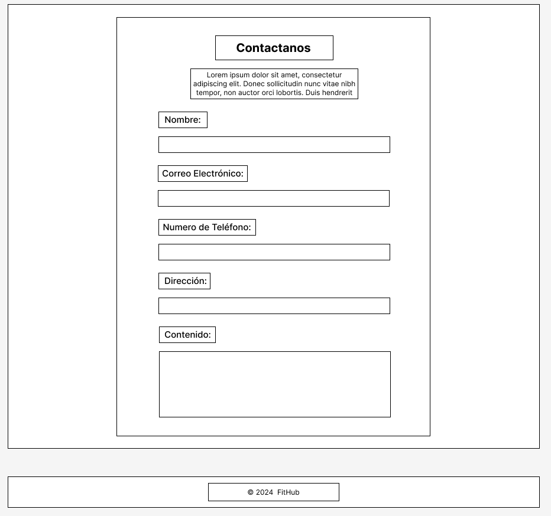

**Landing Page para Mobile Web Browser**

 

### 4.3.2. Landing Page Mock-up
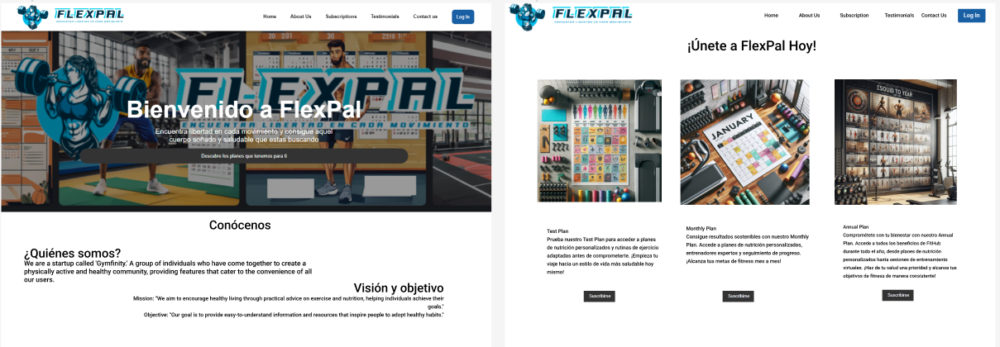

## 4.4. Web Applications UX/UI Design
El diseño de experiencia de usuario (UX) y diseño de interfaz de usuario (UI) para aplicaciones web implica crear una experiencia digital que sea intuitiva, eficiente y satisfactoria para los usuarios. La UX se centra en comprender las necesidades y expectativas del usuario, así como en diseñar flujos de trabajo y arquitectura de información que faciliten la interacción. Por otro lado, la UI se refiere al aspecto visual de la aplicación, incluyendo el diseño de elementos como botones, menús, y la disposición de contenido. Un diseño UX/UI efectivo combina la estética atractiva con la funcionalidad fácil de usar, lo que resulta en una experiencia positiva y memorable para los usuarios.
### 4.4.1. Web Applications Wireframes
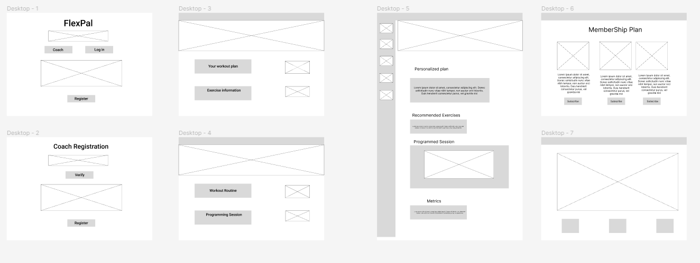
### 4.4.2. Web Applications Wireflow Diagrams

Web Applications Wireflow Diagrams son representaciones visuales de los flujos de navegación y la arquitectura de una aplicación web. Estos diagramas combinan elementos de wireframes y diagramas de flujo para proporcionar una vista general de cómo los usuarios navegarán a través de la aplicación y cómo interactuarán con ella. Los wireflows son útiles para identificar posibles problemas de usabilidad y diseñar una experiencia de usuario coherente y eficiente.

El diagrama de wireflow de FlexPal muestra los diferentes flujos de usuario para los miembros y los coaches, incluyendo la autenticación, la visualización de perfiles, la programación de sesiones y el acceso a las herramientas de asesoramiento y seguimiento.

### 4.4.3. Web Applications Mock-ups

### 4.4.4. Web Applications User Flow Diagrams
El diagrama de flujo de usuario es una representación visual de los pasos que un usuario sigue al interactuar con una aplicación o sitio web. Muestra la secuencia de acciones que el usuario realiza para completar una tarea específica, lo que nos ayuda a identificar posibles puntos de fricción y a optimizar la experiencia del usuario.
  
**Leyenda:**

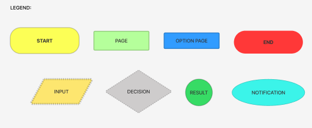
  
**Flujo de Usuario:**
Empieza con el usuario ingresando a la página de inicio de FlexPal. Aqui determina si es "Miembro" o "Coach".

  
**Flujo de Miembro:** 
El usuario Miembro puede acceder a su perfil, ver las rutinas recomendadas, programar sesiones con su coach, y acceder a las herramientas de asesoramiento y seguimiento.

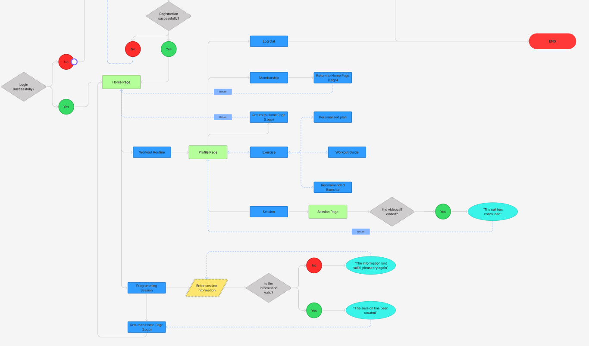
  
**Flujo de Coach:**
El usuario Coach puede acceder a su perfil, ver la lista de miembros, programar sesiones con sus clientes, y acceder a las herramientas de asesoramiento y seguimiento.

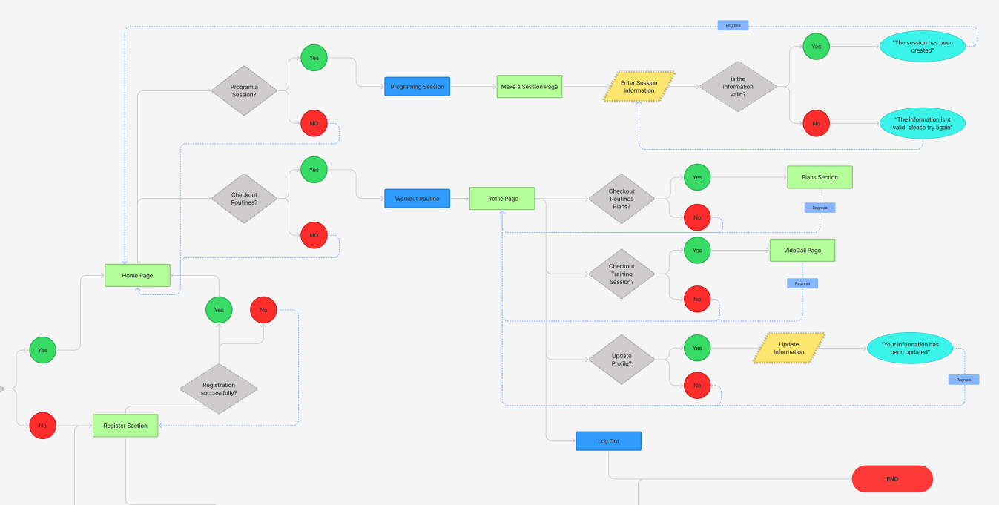
  
**Vista general del flujo de usuario:**

[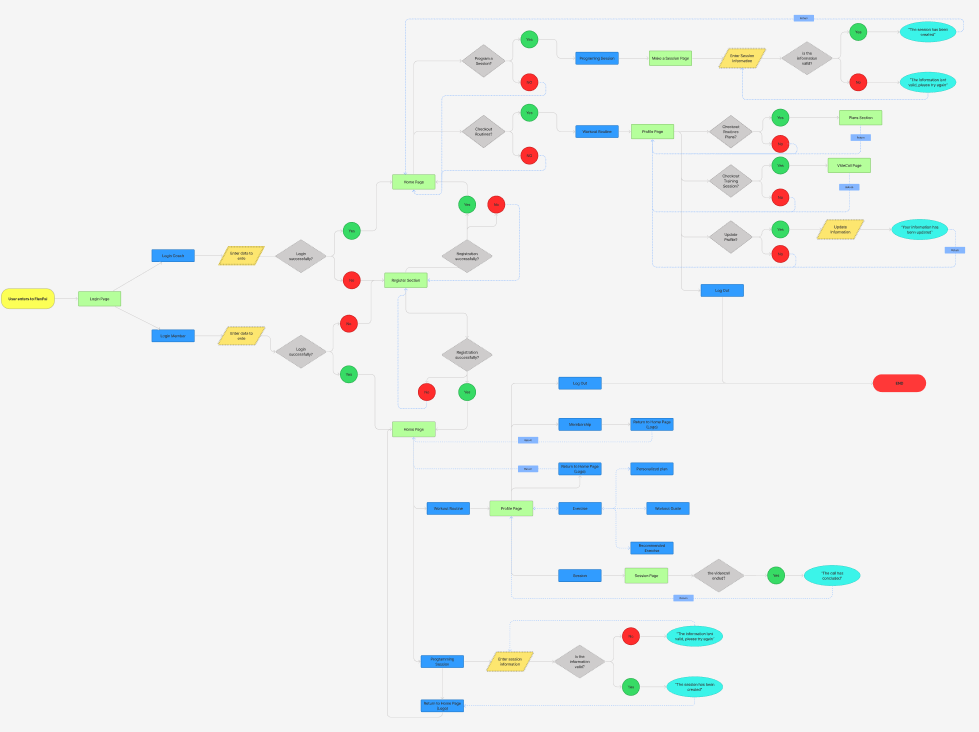](https://www.figma.com/file/91Ez19KOQpxgpmPEZ9NtIm/FlexPal?type=design&node-id=0%3A1&mode=design&t=DA1ZoY7KsViAxYLq-1)

## 4.5. Web Applications Prototyping
Prototipo de la aplicación web FlexPal en Figma:
[Prototipo-FlexPal](https://www.figma.com/file/91Ez19KOQpxgpmPEZ9NtIm/FlexPal?type=design&node-id=0%3A1&mode=design&t=vgM82K5YOfavEdYS-1)
## 4.6. Domain-Driven Software Architecture
La arquitectura de software orientada al dominio es un enfoque de diseño que se centra en la estructura y organización del software en torno a los conceptos y procesos clave de un dominio específico. Este enfoque nos permite crear sistemas que reflejen con precisión los requisitos y la lógica del negocio, lo que facilita la implementación de funcionalidades específicas y la adaptación a los cambios en el dominio. Con FlexPal, utilizamos una arquitectura de software orientada al dominio para estructurar nuestro sistema de manera coherente y escalable, lo que nos permitirá desarrollar una aplicación robusta y fácil de mantener.
### 4.6.1. Software Architecture Context Diagram
**Elementos**:

- FlexPal: Interfaz principal para los usuarios.
- Usuario Miembro: Accede a la aplicación con diferentes niveles de suscripción.
- Usuario Coach: Asesora a los miembros y programa sesiones.
  
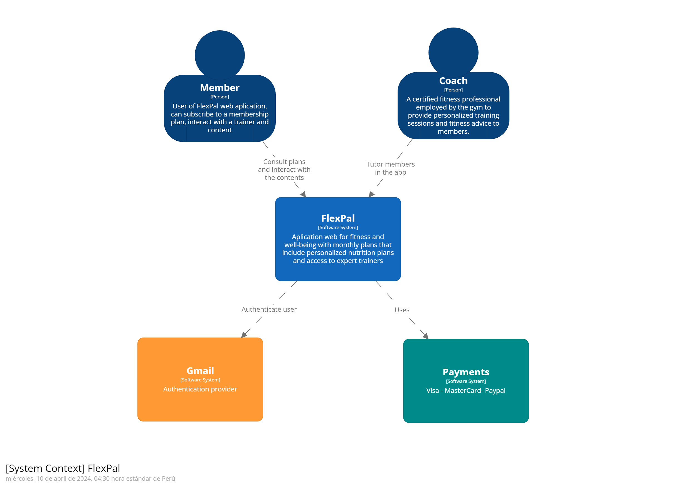
### 4.6.2. Software Architecture Container Diagrams
**Elementos:**

- **Aplicación Web:** Frontend donde los usuarios interactúan con la aplicación.
 **Tecnología: Vue.js.**  

- **Servidor de Aplicaciones:** Backend que maneja la lógica de negocio, autenticación, y gestión de suscripciones.
**Tecnología: C#.**  
- **Base de Datos:** Almacena información de usuarios, suscripciones, rutinas y sesiones.
   **Tecnología: SQL Server.** 
  
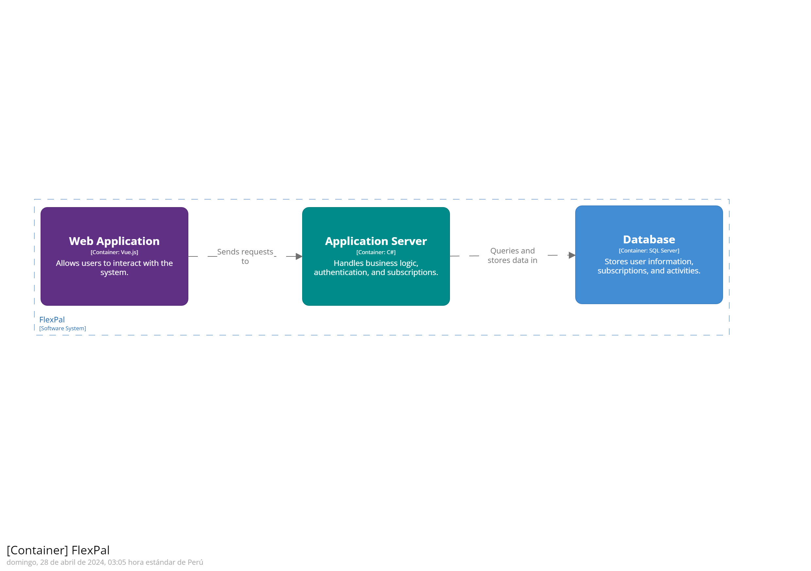
### 4.6.3. Software Architecture Components Diagrams
**Elementos:**

- **Módulo de Autenticación:** Gestiona el inicio de sesión mediante Gmail.   
- **Módulo de Gestión de Suscripciones:** Administra los diferentes planes de suscripción (Free, Monthly, Annual).   
- **Módulo de Gestión de Usuarios:** Maneja la información de perfil y las relaciones entre miembros y coaches.   
- **Módulo de Recomendaciones de Rutinas:** Ofrece rutinas personalizadas basadas en las preferencias y objetivos del usuario.   
- **Módulo de Asesoramiento:** Facilita las interacciones y la programación de sesiones entre miembros y coaches.   
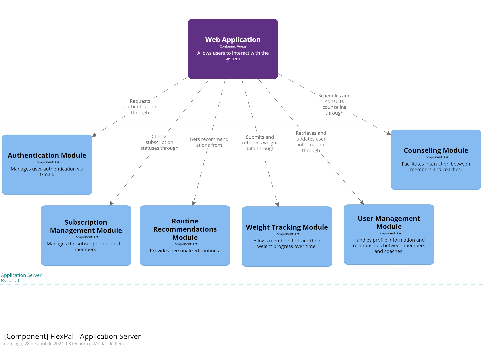
## 4.7. Software Object-Oriented Design
El diseño orientado a objetos del software será esencial para nuestro proyecto. Esta metodología nos permitirá estructurar nuestro sistema de manera modular y escalable, aprovechando los principios de encapsulamiento, herencia y polimorfismo para crear componentes reutilizables y de fácil mantenimiento.
### 4.7.1. Class Diagrams

### 4.7.2. Class Dictionary
#### Platform
- Attributes: landingPageView, userInterface, passwordRecovery, twoFactorAuthentication, notificationSystem, monitoringTools, debuggingTools, continuousIntegrationTests.
#### Member
- Attributes: name, email, password
- Methods: updateProfile(), changePassword(), managePrivacySettings(), viewInterface(), interactWithFeatures(), scheduleTrainingSessions(), accessDataTools(), updatePersonalInfo(), changeLanguage(), customizeTheme(), filterContentByCategory(), postComments(), likePosts(), sharePosts(), followWorkoutRoutines(), trackTrainingProgress(), viewStatistics(), setTrainingGoals(), viewNutritionPlans(), accessRecipes(
#### WorkoutRoutine
- Attributes: description, sets, repetitions, duration.
#### MembershipPlan
- Attributes: planName, duration, price.
#### Session
- Attributes: startTime, endTime, location.
#### Goal
- Attributes: description, targetDate.
#### NutritionPlan
- Attributes: mealPlan, portionSizes.
#### Coach
- Attributes: name, certification.
- Methods: assignWorkoutRoutine(), createNutritionPlan(), viewSchedule(), manageClientList(), viewClientStats(), generateProgressReports(), sendSessionReminders(), scheduleRecurringSessions().
#### User
- Attributes: username, password.
#### Exercise
- Attributes: name, type, intensityLevel.

## 4.8. Database Design.
El diseño de la base de datos será fundamental para nuestro proyecto, ya que proporcionará la estructura subyacente para almacenar y gestionar los datos de manera eficiente y segura. Utilizaremos un enfoque cuidadoso para modelar las tablas, relaciones y restricciones de la base de datos de acuerdo con los requisitos del sistema y las mejores prácticas de diseño. Esto nos permitirá organizar los datos de manera lógica y coherente, facilitando su recuperación y manipulación en respuesta a las solicitudes de los usuarios.
### 4.8.1. Database Diagram.
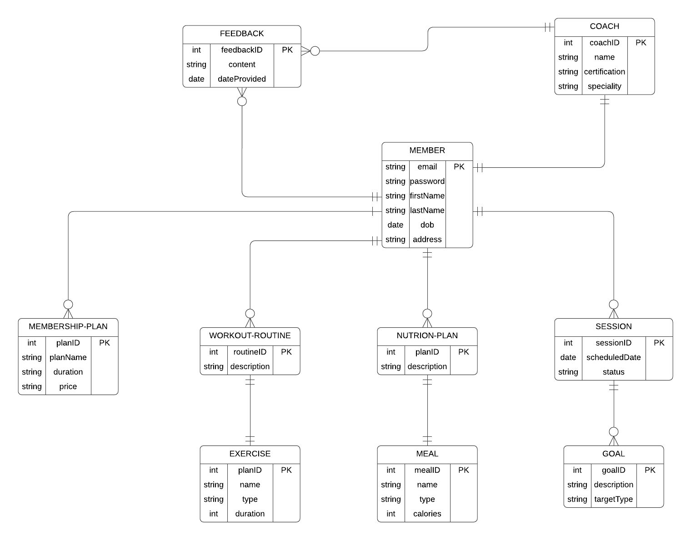
