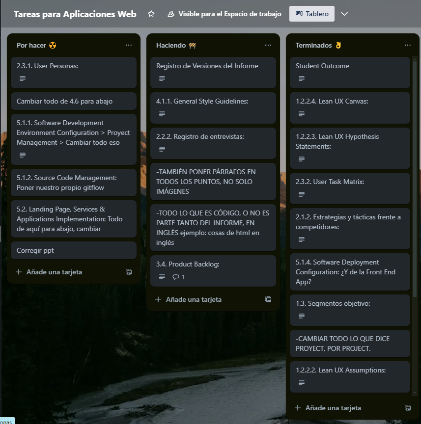
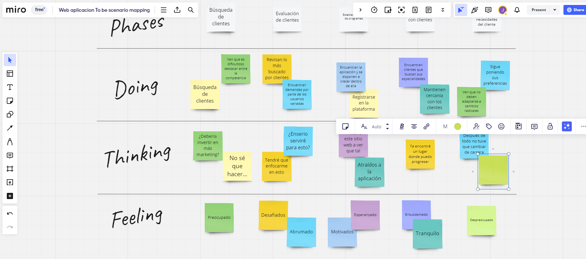
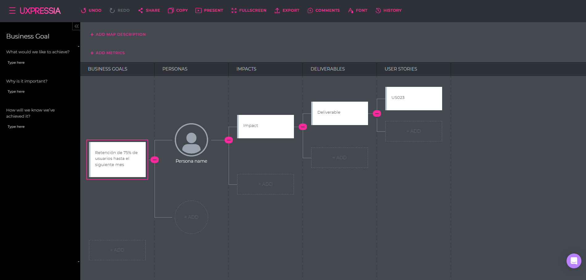
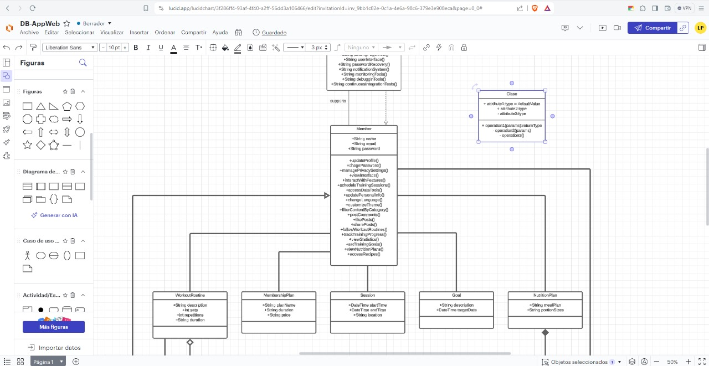
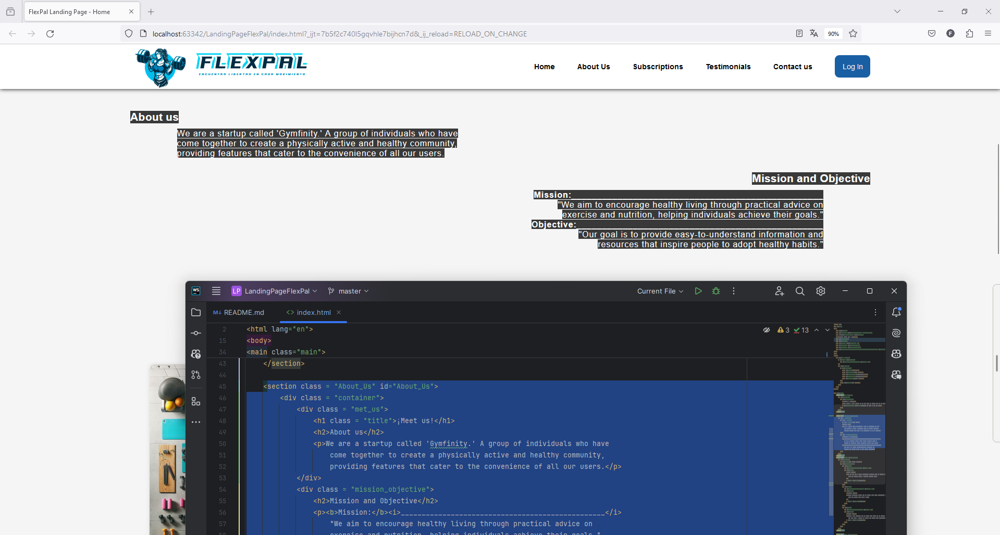
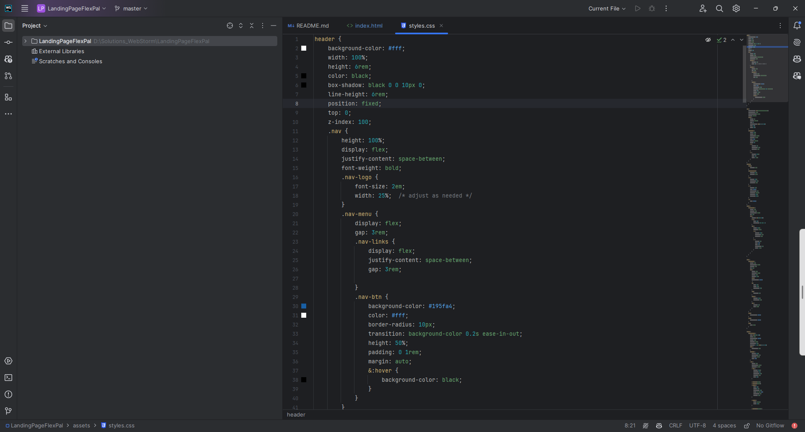

# **Capítulo V: Product Implementation, Validation & Deployment.**
La implementación, validación y despliegue del producto son esenciales para asegurar que la visión del producto se convierta en una realidad funcional y accesible para nuestros usuarios. Estas etapas nos permiten transformar el diseño conceptual en una aplicación real, probada y lista para su uso, lo que nos ayuda a validar nuestras ideas, identificar posibles problemas y ofrecer una experiencia de usuario óptima.
## 5.1. Software Configuration Management.
La gestión de la configuración del software es crucial para nuestro trabajo, ya que nos permite mantener un control preciso sobre los elementos de nuestro proyecto, como el código fuente, los documentos de diseño y los activos digitales. Esto garantiza que todos los miembros del equipo estén trabajando con la misma versión de los archivos y facilita la colaboración entre desarrolladores, diseñadores y otros profesionales involucrados en el proyecto.
### 5.1.1. Software Development Environment Configuration
- ### Project Management:
    * ### Trello:
      Una aplicación de gestión de proyectos que facilita el seguimiento de las tareas individuales de cada miembro del equipo de manera sencilla.  
      [Link De Registro o Inicio De Sesión](https://trello.com/es) 
      Imagen para mostrar evidencia de uso:
      
      *  ### Microsoft Teams
       una plataforma unificada de comunicación y colaboración que combina chat persistente en el lugar de trabajo, reuniones de video, almacenamiento de archivos e integración de aplicaciones.  
        [Link De Registro o Inicio De Sesión](https://www.microsoft.com/es-pe/)
      Imagen para mostrar evidencia de uso:
      

- ### Requirement Management:
    * ### Miro:
      Un sistema que ofrece una amplia gama de plantillas diseñadas para abordar diversos aspectos en la creación y gestión de proyectos.  
      [Link De Registro o Inicio De Sesión](https://miro.com/es/login/)
      Imagen para mostrar evidencia de uso:
      
    * ### UXPressia:
      Es una herramienta en línea que simplifica el proceso de mapeo y comprensión de las necesidades del cliente en un proyecto determinado.  
      [Link De Registro o Inicio De Sesión](https://uxpressia.com)
      Imagen para mostrar evidencia de uso:
      
    * ### Structurizr:
      Se trata de una suite de herramientas que posibilita la creación colaborativa de modelos C4 para representar de forma gráfica nuestros productos.  
      [Link De Registro o Inicio De Sesión](https://structurizr.com)
- ###  Product UX/UI Design:
    * ### Figma:
      Una herramienta de colaboración que facilita el desarrollo conjunto de wireframes y mockups.  
      [Link De Registro, Inicio De Sesión y Descarga](https://www.figma.com/downloads/)
    * ### LucidChart:
      Una herramienta colaborativa que posibilita la creación conjunta de wireframes flow y mockups flow.  
      [Link De Registro o Inicio De Sesión ](https://www.lucidchart.com/pages/es)
      Imagen para mostrar evidencia de uso:
      
- ###  Software Development:
    * ### HTML5:
      Es un lenguaje de etiquetado utilizado para crear la estructura a páginas web. Lo utilizamos para incluir componentes como texto, imágenes, enlaces, botones y videos en nuestras páginas web.  
      [Información Relacionada](https://www.esic.edu/rethink/tecnologia/html5-que-es-caracteristicas-y-como-funciona-c#:~:text=El%20HTML5%20es%20un%20estándar,%2C%20estilo%20de%20letra%2C%20etc.)
      Imagen para mostrar evidencia de uso:
      
    * ### CSS:
      Un lenguaje de diseño gráfico utilizado para dar formato y estilo a la presentación de un documento escrito en HTML.  
      [Información Relacionada](https://developer.mozilla.org/es/docs/Web/CSS)
      Imagen para mostrar evidencia de uso:
      
    * ### JavaScript:
      Un lenguaje de programación orientado a objetos dinámico que utilizamos para implementar funcionalidades en un documento HTML.  
      [Información Relacionada]( https://developer.mozilla.org/es/docs/Web/JavaScript )
      Imagen para mostrar evidencia de uso:
      
    * ### WebStorm:
      Un entorno de desarrollo integrado (IDE) que emplearemos para trabajar con JavaScript.  
      [Link De Descarga]( https://www.jetbrains.com/es-es/webstorm/)

- ###  Software Testing:
    * ### Lenguaje Gherkin:
      Se trata de un Lenguaje Específico de Dominio (DSL), diseñado específicamente para abordar un problema particular. Es un lenguaje comprensible para los desarrolladores, destinado a resolver necesidades concretas.  
- ###  Software Documentation:
    * ### Github:
      Se trata de una plataforma utilizada para el alojamiento de versiones del código fuente de un proyecto. Es una herramienta ampliamente popular en el trabajo colaborativo de programadores.  
      [Link De Descarga]( https://desktop.github.com)
      [Link De Registro o Inicio De Sesión](https://github.com/login)
- ###  Software Deployment:
    * ### GitHub Pages: 
      Una plataforma que posibilita la realización de despliegues simples directamente desde un repositorio de GitHub.  
