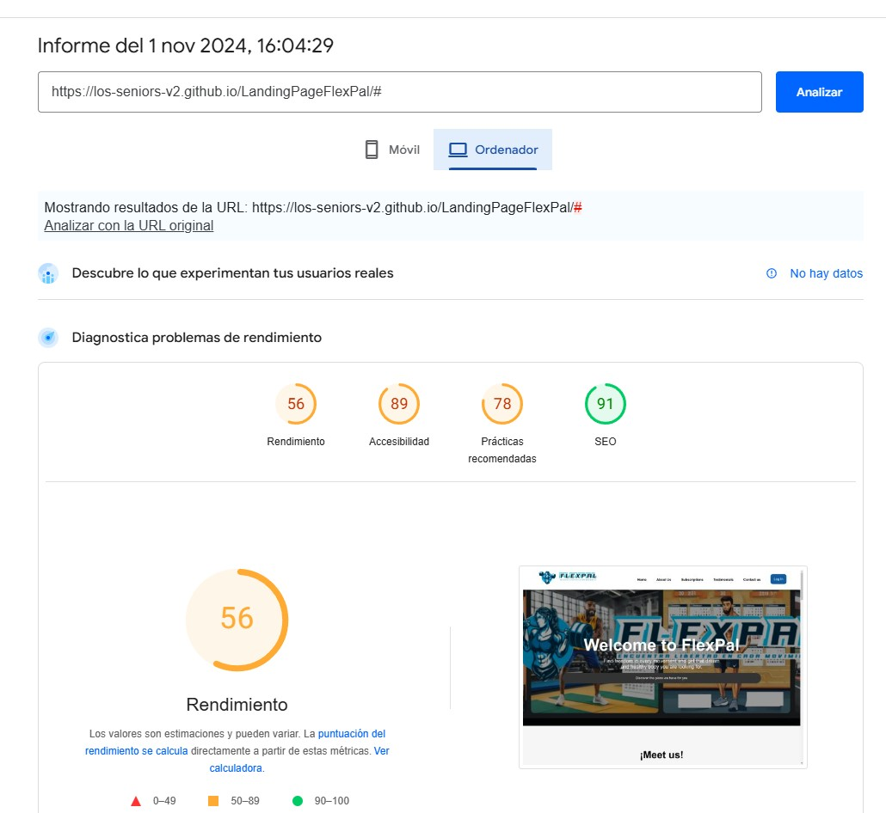
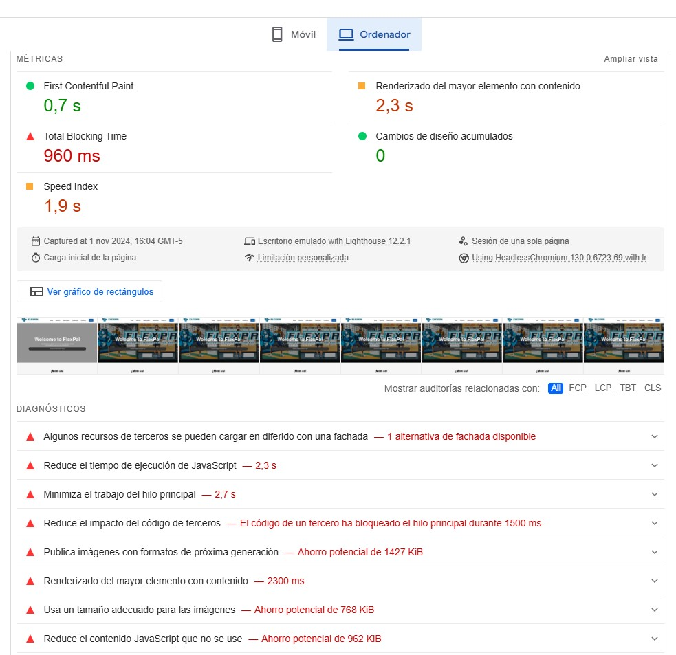

 # **Capítulo VI: Product Verification & Validation**
## 6.1. Testing Suites & Validation
### 6.1.1. Core Entities Unit Tests.
Para la elaboración de los principales test de nuestra Landing Page, hemostenido en cuenta las secciones más importantes, las cuales son el 
- About Us
- Subscription
- Testimonials
- Contact Us
Gracias a la herramienta de Selenium-IDE se ha logrado realizar los test que seejecutaron en la Landing Page que se muestra a continuación.

### 6.1.2. Core Integration Tests.

### 6.1.3. Core Behavior-Driven Development
Estamos inmersos en el desarrollo de un sitio web que ofrece a los usuariosla capacidad de registrarse y acceder a una base de datos. En este proceso,podemos aprovechar los principios y prácticas del Behiavor-Driven-Development(BDD) para optimizar nuestra colaboración, definir y refinar los requisitos, yautomatizar las pruebas de aceptación. Una estrategia eficaz para estructurar estaspruebas es la técnica Given-When-Then. Por ejemplo, al considerar el escenario enel cual un usuario registrado accede a la base de datos, podemos seguir esteformato:
- Dado que soy un usuario del segmento coach en Flexpal y he iniciado sesión en la aplicación.
- Cuando el administrador haga clic en el botón de generar reporte.
- Entonces el administrador recibe un reporte detallado del inventario del sistema. Este enfoque nos permite clarificar las acciones previas, la acción en símisma y los resultados esperados, facilitando así la comprensión y ejecución de laspruebas de aceptación.
### 6.1.4. Core System Tests.
Para realizar los Core System tests, se ha seleccionado usar la herramienta“Lighthouse” en el cual se han realizado evaluaciones para nuestra Landing Pagedesplegada, las evaluaciones ejecutadas, se centran en el rendimiento principal denuestra Landing Page, accesibilidad y uso, a continuación se muestran mejoresdetalles.

El análisis realizado muestra que la página cumple con buenos niveles en accesibilidad y SEO, lo cual es positivo para la experiencia de usuario y el posicionamiento en buscadores. Sin embargo, el rendimiento general puede mejorarse significativamente. Las principales áreas de oportunidad están en la optimización de JavaScript, la carga diferida de recursos de terceros y la optimización de imágenes.

Siguientes Pasos Recomendados
- Revisar y Optimizar el Código JavaScript: Minimiza el código y aplica técnicas de carga diferida.
- Reducir el Impacto de Recursos de Terceros: Utiliza alternativas diferidas o carga condicional.
- Optimizar el Peso y Formato de Imágenes: Convierte las imágenes a formatos como WebP y ajusta el tamaño.
- Implementar Buenas Prácticas para Mejorar el LCP y el TBT.

## 6.2. Static Testing & Verification

### 6.2.1. Static Code Analysis:

### 6.2.1.1. Coding standard & Code conventions:

En esta sección, se documentarán los estándares de codificación y las convenciones de código utilizados para el proyecto FlexApp Landing Page. El objetivo es asegurar un código legible, mantenible y consistente.

1. Estructura General del Documento HTML
Estándar W3C HTML5: Se utiliza !DOCTYPE html para indicar que el documento cumple con HTML5, lo cual es importante para la correcta interpretación del HTML en todos los navegadores.
Uso de Etiquetas HTML estándar: La estructura principal del documento sigue las pautas de HTML5, manteniendo la claridad y organización del contenido dentro de etiquetas semánticas como html, head, body, header, main, section, y footer.
Ejemplo:
<!-- 
<!DOCTYPE html> 
<html lang="en"> 
... 
</html> 
-->

2. Declaración de Metadatos
Estándar de Accesibilidad y SEO: Las etiquetas meta de description, keywords, y author mejoran la optimización para motores de búsqueda (SEO) y ayudan a proporcionar información adicional sobre el sitio.
Compatibilidad con Dispositivos Móviles: La etiqueta meta name="viewport" content="width=device-width, initial-scale=1.0" garantiza que la página sea responsiva en dispositivos móviles.
Ejemplo:
<!-- <head> -->
<!--     <meta charset="UTF-8"> -->
<!--     <meta name="viewport" content="width=device-width, initial-scale=1.0"> -->
<!--     <meta name="description" content="Explora destinos nuevos y emocionantes con nuestra agencia de viajes."> -->
<!--     <meta name="keywords" content="viajes, destinos, agencia de viajes, turismo, aventura"> -->
<!--     <meta name="author" content="UniqueTrip App"> -->
<!-- </head> -->

3. Convenciones de Nombres
Estándar de Nomenclatura BEM: Se utilizan nombres en kebab-case para clases e IDs en el CSS, siguiendo el estándar BEM (Block Element Modifier), que facilita la lectura y organización del código CSS.
Nombres Claros y Descriptivos: Cada nombre de clase e ID se elige para que represente claramente su función o contenido, mejorando la mantenibilidad y comprensión del código.
Ejemplo:
<!-- <section class="about-us" id="about-us"> -->

4. Organización de CSS
Estándar de Organización de CSS: Los archivos CSS se cargan de forma modular (primero base.css para estilos generales y luego styles.css para estilos específicos) según la práctica recomendada de separación de responsabilidades en CSS.
Optimización de Recursos: La fuente externa se carga desde un CDN de Google Fonts, siguiendo las prácticas recomendadas para mejorar el rendimiento. El uso del atributo preload es opcional y se utiliza para reducir el tiempo de carga.
Ejemplo:
<!-- <link rel="stylesheet" href="assets/base.css"> -->
<!-- <link rel="stylesheet" href="assets/styles.css"> -->
<!-- <link href="https://fonts.googleapis.com/css?family=Poppins:400,700&display=swap" rel="stylesheet" preload> -->

5. Accesibilidad (A11Y)
Estándar de Accesibilidad WCAG: Todas las imágenes tienen un atributo alt que describe su contenido. Esto ayuda a los usuarios de lectores de pantalla y mejora la accesibilidad en línea con las pautas WCAG (Web Content Accessibility Guidelines).
Etiquetas ARIA: Para mejorar la accesibilidad, se utilizan atributos aria-label en elementos interactivos para describir su función. Esto asegura que todos los usuarios puedan comprender el propósito de los elementos.
Ejemplo:
<!-- <a href="#hero" class="nav-logo" aria-label="FlexApp Logo"> -->
<!--      -->
<!-- </a> -->

6. Convenciones para CSS en Línea
Estándar de Separación de Estilos: Evitar CSS en línea (inline CSS) sigue la recomendación de mantener el HTML y CSS separados para mejorar la legibilidad y reutilización de código. El uso de estilos en línea está permitido solo para casos específicos como botones en a y se minimiza en lo posible.
Ejemplo:
<!-- <a href="http://flexpal-seniors.web.app" class="nav-btn-link"> -->
<!--     <button class="nav-btn">Log In</button> -->
<!-- </a> -->

7. Comentarios en el Código
Buenas Prácticas de Documentación: Agregar comentarios al inicio de cada sección HTML para documentar su propósito. Esto es esencial para la colaboración en equipo y facilita la comprensión y mantenimiento del código.
Ejemplo:
<!-- <!-- Header --> -->
<!-- <header> -->
<!--     ... -->
<!-- </header> -->

8. Buenas Prácticas para el SEO
SEO Friendly: El uso de etiquetas de encabezado en orden jerárquico (h1, h2, h3, etc.) ayuda tanto en accesibilidad como en optimización para motores de búsqueda.
URLs Descriptivos: Los enlaces internos son relativos y se evitan enlaces vacíos (href="#") excepto en prototipos, siguiendo prácticas de SEO y UX.
Ejemplo:
<!-- <h1>Welcome to FlexApp</h1> -->
<!-- <h2>About Us</h2> -->
<!-- <a href="#destinations" class="btn-2">Discover the plans we have for you</a> -->

9. Uso de Secciones Semánticas
HTML5 Semántico: Se utilizan etiquetas HTML5 como header, main, section, footer para definir las áreas principales de la página. Esto mejora tanto la accesibilidad como la claridad estructural del documento, cumpliendo con el estándar W3C.
Ejemplo:
<!-- <main class="main"> -->
<!--     <section class="hero" id="hero"> -->
<!--         ... -->
<!--     </section> -->
<!-- </main> -->

### 6.2.1.2. Code Quality & Code Security: 

### 6.2.2 Reviews: 

## 6.3. Validation Interviews
### 6.3.1. Diseño de Entrevistas.
* **Individuos interesados en mejorar su salud y condición física:**
1.	¿Qué tan fácil te resulta navegar en la aplicación?
2.	¿Consideras que el proceso para configurar tus preferencias (como planes de entrenamiento o alimentación) es intuitivo?
3.	¿Qué tan útil encuentras la función de seguimiento de progreso en la aplicación? ¿Qué mejorarías?
4.	¿Te resulta fácil acceder a tus planes de nutrición y rutinas de ejercicio?
5.	¿Sientes que la interfaz es visualmente atractiva y motivadora? ¿Por qué sí o por qué no?
6.	¿Alguna vez te has sentido perdido o confundido al usar la aplicación? Si es así, ¿en qué momento?
7.	¿Qué tan satisfactorio es el nivel de personalización de la aplicación (como dietas adaptadas a tus preferencias)?
8.	¿Cómo describirías tu experiencia al comunicarte con los coaches dentro de la aplicación?
9.	¿La aplicación satisface tus expectativas en cuanto a motivación y seguimiento de tus metas?
10.	¿Recomendarías esta aplicación a otros usuarios interesados en mejorar su condición física? ¿Por qué?

* **Profesionales del coaching en ejercicio y alimentación:**
1.	¿Qué tan intuitiva te resulta la interfaz de la aplicación al organizar sesiones y rutinas?
2.	¿Consideras que la aplicación facilita una comunicación efectiva con tus clientes?
3.	¿Te sientes cómodo usando las herramientas de seguimiento de progreso para tus clientes? ¿Qué mejorarías?
4.	¿Cómo calificarías la facilidad de acceso a la información de tus clientes y sus progresos?
5.	¿La plataforma permite personalizar rutinas y planes de alimentación de forma eficiente?
6.	¿Crees que la aplicación es segura y protege adecuadamente los datos de tus clientes?
7.	¿Qué tan útil encuentras el diseño y la organización visual de la aplicación para tu trabajo diario?
8.	¿Te parece adecuado el soporte que ofrece la aplicación para gestionar múltiples clientes?
9.	¿Te sientes motivado a usar la plataforma regularmente como herramienta de coaching? ¿Por qué sí o no?
10.	¿Qué recomendarías para mejorar la plataforma y hacerla más útil en tu trabajo?

### 6.3.2. Registro de Entrevistas.
### 6.3.3. Evaluaciones según heurísticas.

## 6.4. Auditoría de Experiencias de Usuario
### 6.4.1. Auditoría realizada.
### 6.4.2. Auditoría recibida.
#### Auditoría de Experiencia de Usuario (UX)

##### Resumen Ejecutivo
Este documento presenta la auditoría de experiencia de usuario (UX) realizada sobre las interfaces del producto, cubriendo la Landing Page, el Frontend de la Aplicación Web, y la Aplicación Móvil (si aplica). La auditoría se enfoca en evaluar la consistencia visual, navegabilidad, accesibilidad, claridad en el diseño, y criterios de inclusión, con el objetivo de optimizar la interacción del usuario y la usabilidad del producto.

##### Metodología
La auditoría fue llevada a cabo utilizando un enfoque de revisión heurística y análisis de usabilidad, revisando los elementos de diseño según estándares de UX. Cada sección fue evaluada en base a principios de consistencia, accesibilidad, y facilidad de navegación, documentando puntos fuertes y áreas de mejora para cada uno.

##### 1. Landing Page
La Landing Page representa el punto de entrada principal para el usuario. A continuación, se detalla la evaluación de aspectos clave:

###### Consistencia Visual
La página muestra coherencia en el uso de colores, tipografía y espaciado, alineándose con las pautas de estilo. El diseño visual es atractivo y ayuda a orientar al usuario desde el inicio. Se recomienda mejorar algunos contrastes de color para asegurar una mejor legibilidad en ciertas áreas.

###### Navegabilidad y Accesibilidad
La navegación es intuitiva, con menús y enlaces bien organizados. La accesibilidad podría mejorarse mediante etiquetas ARIA y una optimización de elementos interactivos para usuarios con necesidades especiales. La inclusión de un botón de búsqueda visible podría también mejorar la experiencia.

##### 2. Frontend de la Aplicación Web
El frontend de la aplicación web es fundamental para la interacción continua del usuario con el producto. La auditoría en esta sección incluyó:

###### Arquitectura de la Información
Se evaluaron los sistemas de organización y etiquetado para asegurar que sean intuitivos y permitan al usuario navegar eficientemente por la aplicación. Se observó que la estructura de navegación es clara y los elementos son identificables fácilmente.

###### Claridad del Diseño y Consistencia
La interfaz del frontend sigue las pautas de estilo de manera consistente, asegurando que los elementos sean fáciles de identificar y utilizar. Esta coherencia facilita la usabilidad y permite al usuario orientarse rápidamente en la plataforma.

###### Evaluación Inclusiva
El diseño fue revisado para confirmar que se implementaron buenas prácticas de accesibilidad. La plataforma tiene en cuenta la diversidad de usuarios, facilitando el acceso y la interacción incluso para usuarios con distintas capacidades o limitaciones.

##### 3. Aplicación Móvil (si aplica)
En caso de que el producto incluya una aplicación móvil, se realizó una evaluación específica para esta plataforma, abarcando los siguientes puntos:

###### Consistencia con la Versión Web
Se revisó que los elementos de diseño en la versión móvil sean consistentes con los de la versión web. La interfaz móvil sigue las mismas pautas de estilo, garantizando una experiencia coherente en ambas plataformas.

###### Facilidad de Navegación en Móvil
La disposición de los elementos y la navegación en la aplicación móvil fueron evaluadas para asegurar que sean fáciles de usar en dispositivos de menor tamaño. El diseño es intuitivo y permite al usuario acceder rápidamente a las funcionalidades clave.

##### Recomendaciones
A partir de los hallazgos de la auditoría, se sugieren las siguientes mejoras para optimizar la experiencia de usuario:

- Mejorar los contrastes de color en la Landing Page para aumentar la legibilidad.
- Implementar etiquetas ARIA y otros elementos de accesibilidad en la navegación.
- Agregar breadcrumbs en el frontend de la aplicación web para una navegación más clara.
- Introducir iconografía en botones clave del frontend para mejorar la intuición de uso.
- Adaptar ciertos elementos de la aplicación móvil para optimizar su usabilidad en pantallas pequeñas.

##### Conclusión
La auditoría de UX confirma que el producto cumple con los principios fundamentales de usabilidad y accesibilidad, aunque con áreas de mejora. Las recomendaciones proporcionadas apuntan a optimizar aún más la experiencia del usuario, asegurando que el producto sea intuitivo, accesible, y visualmente coherente en todas sus plataformas (web y móvil).
