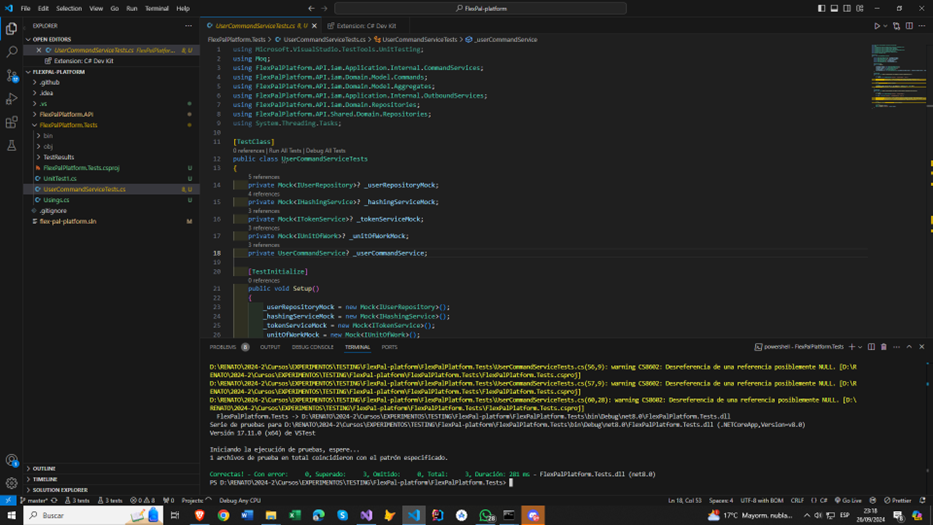
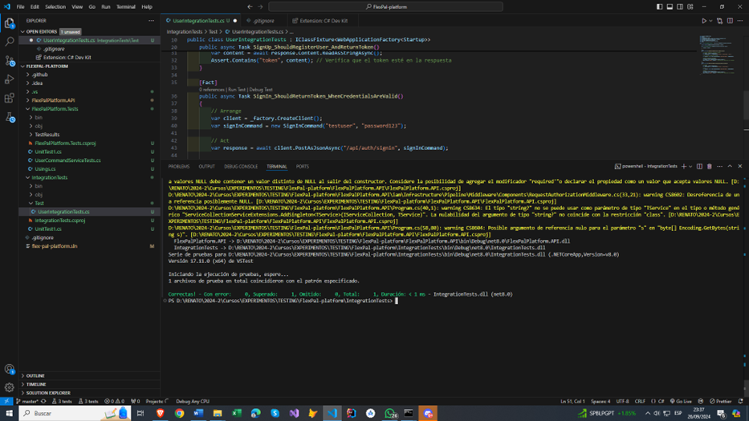

 # **Capítulo VI: Product Verification & Validation**
## 6.1. Testing Suites & Validation
### 6.1.1. Core Entities Unit Tests.
Para la elaboración de los principales test de nuestra Landing Page, hemostenido en cuenta las secciones más importantes, las cuales son el 
- About Us
- Subscription
- Testimonials
- Contact Us
Gracias a la herramienta de Selenium-IDE se ha logrado realizar los test que seejecutaron en la Landing Page que se muestra a continuación.

### 6.1.2. Core Integration Tests.

### 6.1.3. Core Behavior-Driven Development
Estamos inmersos en el desarrollo de un sitio web que ofrece a los usuariosla capacidad de registrarse y acceder a una base de datos. En este proceso,podemos aprovechar los principios y prácticas del Behiavor-Driven-Development(BDD) para optimizar nuestra colaboración, definir y refinar los requisitos, yautomatizar las pruebas de aceptación. Una estrategia eficaz para estructurar estaspruebas es la técnica Given-When-Then. Por ejemplo, al considerar el escenario enel cual un usuario registrado accede a la base de datos, podemos seguir esteformato:
- Dado que soy un usuario del segmento coach en Flexpal y he iniciado sesión en la aplicación.
- Cuando el administrador haga clic en el botón de generar reporte.
- Entonces el administrador recibe un reporte detallado del inventario del sistema. Este enfoque nos permite clarificar las acciones previas, la acción en símisma y los resultados esperados, facilitando así la comprensión y ejecución de laspruebas de aceptación.
### 6.1.4. Core System Tests.
Para realizar los Core System tests, se ha seleccionado usar la herramienta“Lighthouse” en el cual se han realizado evaluaciones para nuestra Landing Pagedesplegada, las evaluaciones ejecutadas, se centran en el rendimiento principal denuestra Landing Page, accesibilidad y uso, a continuación se muestran mejoresdetalles.

[Imagen evidencia del Core System test]

## 6.3. Validation Interviews
### 6.3.1. Diseño de Entrevistas.
### 6.3.2. Registro de Entrevistas.
### 6.3.3. Evaluaciones según heurísticas.

## 6.4. Auditoría de Experiencias de Usuario
### 6.4.1. Auditoría realizada.
### 6.4.2. Auditoría recibida.
