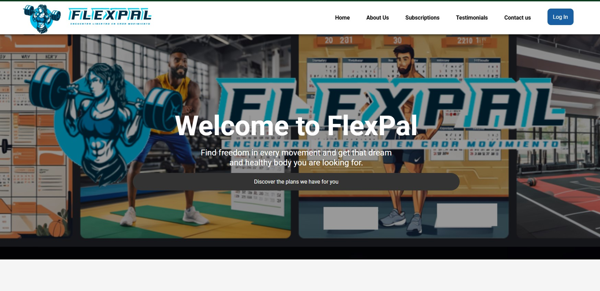

 # **Capítulo VI: Product Verification & Validation**
## 6.1. Testing Suites & Validation
### 6.1.1. Core Entities Unit Tests.
Para la elaboración de los principales test de nuestra Landing Page, hemostenido en cuenta las secciones más importantes, las cuales son el 
- About Us
- Subscription
- Testimonials
- Contact Us
Gracias a la herramienta de Selenium-IDE se ha logrado realizar los test que seejecutaron en la Landing Page que se muestra a continuación.

### 6.1.2. Core Integration Tests.

### 6.1.3. Core Behavior-Driven Development
Estamos inmersos en el desarrollo de un sitio web que ofrece a los usuariosla capacidad de registrarse y acceder a una base de datos. En este proceso,podemos aprovechar los principios y prácticas del Behiavor-Driven-Development(BDD) para optimizar nuestra colaboración, definir y refinar los requisitos, yautomatizar las pruebas de aceptación. Una estrategia eficaz para estructurar estaspruebas es la técnica Given-When-Then. Por ejemplo, al considerar el escenario enel cual un usuario registrado accede a la base de datos, podemos seguir esteformato:
- Dado que soy un usuario del segmento coach en Flexpal y he iniciado sesión en la aplicación.
- Cuando el administrador haga clic en el botón de generar reporte.
- Entonces el administrador recibe un reporte detallado del inventario del sistema. Este enfoque nos permite clarificar las acciones previas, la acción en símisma y los resultados esperados, facilitando así la comprensión y ejecución de laspruebas de aceptación.
### 6.1.4. Core System Tests.
Para realizar los Core System tests, se ha seleccionado usar la herramienta“Lighthouse” en el cual se han realizado evaluaciones para nuestra Landing Pagedesplegada, las evaluaciones ejecutadas, se centran en el rendimiento principal denuestra Landing Page, accesibilidad y uso, a continuación se muestran mejoresdetalles.

El análisis realizado muestra que la página cumple con buenos niveles en accesibilidad y SEO, lo cual es positivo para la experiencia de usuario y el posicionamiento en buscadores. Sin embargo, el rendimiento general puede mejorarse significativamente. Las principales áreas de oportunidad están en la optimización de JavaScript, la carga diferida de recursos de terceros y la optimización de imágenes.

Siguientes Pasos Recomendados
- Revisar y Optimizar el Código JavaScript: Minimiza el código y aplica técnicas de carga diferida.
- Reducir el Impacto de Recursos de Terceros: Utiliza alternativas diferidas o carga condicional.
- Optimizar el Peso y Formato de Imágenes: Convierte las imágenes a formatos como WebP y ajusta el tamaño.
- Implementar Buenas Prácticas para Mejorar el LCP y el TBT.

## 6.2. Static Testing & Verification

### 6.2.1. Static Code Analysis:

### 6.2.1.1. Coding standard & Code conventions:

En esta sección, se documentarán los estándares de codificación y las convenciones de código utilizados para el proyecto FlexApp Landing Page. El objetivo es asegurar un código legible, mantenible y consistente.

#### Estructura General del Documento HTML

- Estándar W3C HTML5: Se utiliza <!DOCTYPE html> para indicar que el documento cumple con HTML5, lo cual es importante para la correcta interpretación del HTML en todos los navegadores.
- Uso de Etiquetas HTML estándar: La estructura principal del documento sigue las pautas de HTML5, manteniendo la claridad y organización del contenido dentro de etiquetas semánticas como <html>, <head>, <body>, <header>, <main>, <section>, y <footer>.

<!DOCTYPE html>
<html "lang="en">
...
</html>

#### Declaración de Metadatos

- Estándar de Accesibilidad y SEO: Las etiquetas <meta> de description, keywords, y author mejoran la optimización para motores de búsqueda (SEO) y ayudan a proporcionar información adicional sobre el sitio.
- Compatibilidad con Dispositivos Móviles: La etiqueta <meta "name="viewport" content="width=device-width, initial-scale=1.0"> garantiza que la página sea responsiva en dispositivos móviles.

ejemplo: 

<head>
    <meta charset="UTF-8">
    <meta name="viewport" content="width=device-width, initial-scale=1.0">
    <meta name="description" content="Explora destinos nuevos y emocionantes con nuestra agencia de viajes.">
    <meta name="keywords" content="viajes, destinos, agencia de viajes, turismo, aventura">
    <meta name="author" content="UniqueTrip App">
</head>

### 6.2.1.2. Code Quality & Code Security: 

### 6.2.2 Reviews: 

## 6.3. Validation Interviews
### 6.3.1. Diseño de Entrevistas.
### 6.3.2. Registro de Entrevistas.
### 6.3.3. Evaluaciones según heurísticas.

## 6.4. Auditoría de Experiencias de Usuario
### 6.4.1. Auditoría realizada.
### 6.4.2. Auditoría recibida.
