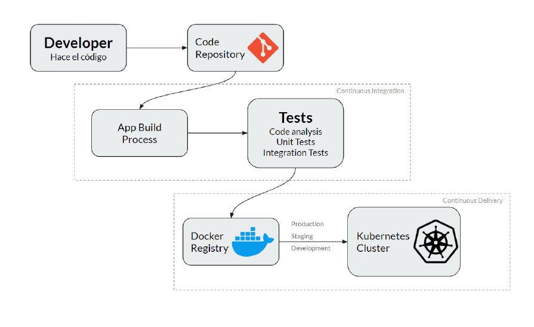

# **Capítulo VII: DevOps Practices**
## 7.1. Continuous Integration
### 7.1.1. Tools and Practices.
La integración continua es una estrategia en el desarrollo de software la cuallos desarrolladores utilizan para fusionar sus cambios de código con la ramamain muchas veces al día. Esto desencadena una secuencia automatizadade compilación y pruebas que se completa de manera muy rápida. Este enfoque busca asegurar un proceso de desarrollo predecible y confiable, conequipos capaces de detectar y solucionar rápidamente cualquier problema decompilación. En la competencia tecnológica, las empresas utilizan laintegración continua para agilizar la introducción de nuevas características,acelerar la corrección de errores y reducir el tiempo de lanzamiento al mercado de sus productos. Es crucial que todos los desarrolladores involucrados en el proyecto se comprometan con esta práctica, tomando medidas inmediatas para solucionar cualquier inconveniente que surja.
### 7.1.2. Build & Test Suite Pipeline Components.

## 7.2 Continuous Delivery

### 7.2.1 Tools and Practices
La entrega continua (CD) se refiere al proceso de garantizar que los cambios en el código estén listos para ser lanzados a producción después de pasar por una serie de pruebas automatizadas.

- **Herramientas principales:**
  - **GitHub Actions, Jenkins y GitLab CI/CD:** Utilizados para construir pipelines que gestionen las pruebas, despliegues, y aprobaciones manuales necesarias antes de la implementación en producción.
  - **Spinnaker:** Herramienta de entrega continua desarrollada por Netflix, que facilita la creación y gestión de pipelines de despliegue.
  - **Argo CD:** Herramienta de despliegue continuo para Kubernetes.
  
- **Prácticas comunes:**
  - **Branching Strategy:** Usar estrategias de ramificación como GitFlow para gestionar cambios.
  - **Test Automatizados en Múltiples Entornos:** Ejecutar pruebas en entornos de staging y producción para validar el comportamiento del sistema.
  - **Aprobaciones Manuales:** Contar con una última fase de aprobación manual antes del despliegue en producción.

### 7.2.2 Stages Deployment Pipeline Components
Un pipeline de entrega continua suele incluir las siguientes etapas:

- **Test Stage:** 
  - **Pruebas Unitarias:** Valida cada componente del código.
  - **Pruebas de Aceptación:** Ejecutadas mediante herramientas como **Selenium** para simular el comportamiento del usuario.
- **Staging Environment:** Un entorno lo más parecido a producción. Herramientas como **Docker** y **Kubernetes** ayudan a orquestar contenedores y asegurar la portabilidad de las aplicaciones.
- **Deployment Stage:** Automatización del despliegue usando **GitHub Actions** o **GitLab CI/CD**.
- **Release Stage:** Monitorización continua usando herramientas como **New Relic** o **Prometheus** para identificar problemas en tiempo real.
- **Rollback and Recovery:** **MySQL** se utiliza para hacer respaldos de datos, y Git maneja las versiones de código.
- **Release Management:** Herramientas de control de versiones como **Git** o **GitHub** gestionan versiones y revisiones.

## 7.3 Continuous Deployment

### 7.3.1 Tools and Practices
La implementación continua lleva la entrega continua un paso más allá, desplegando automáticamente cada cambio aprobado en producción.

- **Herramientas principales:**
  - **Jenkins y GitLab CI/CD:** Para automatizar todo el pipeline de despliegue en producción.
  - **AWS CodePipeline y Google Cloud Build:** Herramientas específicas de CI/CD de proveedores de la nube.
  - **Octopus Deploy:** Para gestionar despliegues en múltiples entornos.
  
- **Prácticas comunes:**
  - **Branching Strategy:** GitFlow u otras estrategias de branching que faciliten la integración y despliegue de código.
  - **Canary Releases y Blue-Green Deployments:** Técnicas de despliegue que minimizan el impacto de cambios en el entorno de producción.
  - **Rollbacks Automáticos:** Configurar la capacidad de revertir despliegues en caso de fallos críticos.

### 7.3.2 Production Deployment Pipeline Components
El pipeline de despliegue en producción incluye:

- **Source Control Management:** Git permite gestionar cambios y versiones de manera organizada.
- **Build and Compilation:** Usando herramientas como **builder de Angular** para frontend o **Gradle** y **Maven** para backend.
- **Artifact Repository:** Repositorios como **Nexus** o **Artifactory** guardan artefactos compilados y aseguran la trazabilidad del código en producción.

## 7.4 Continuous Monitoring

### 7.4.1 Tools and Practices
El monitoreo continuo permite analizar el comportamiento de los sistemas en producción en tiempo real, lo cual ayuda a identificar y resolver problemas rápidamente.

- **Herramientas principales:**
  - **Prometheus y Grafana:** Prometheus se utiliza para recopilar métricas y Grafana para visualizarlas.
  - **New Relic y Dynatrace:** Herramientas avanzadas para monitorear rendimiento y detectar anomalías.
  - **ELK Stack (Elasticsearch, Logstash, Kibana):** Solución de administración de registros que ayuda a visualizar y analizar logs de aplicaciones.
  
- **Prácticas comunes:**
  - **Log Aggregation:** Centralizar los registros de aplicación y sistema.
  - **Alert Thresholds:** Configuración de umbrales para detectar cuando el rendimiento se ve afectado.
  - **Response Time Monitoring:** Monitorear el tiempo de respuesta de los servicios críticos.

### 7.4.2 Monitoring Pipeline Components
El pipeline de monitoreo incluye:

- **Metric Collection:** Recopilación de métricas de CPU, memoria, y otras estadísticas de recursos con herramientas como **Prometheus**.
- **Logs Management:** Uso de **ELK Stack** para centralizar y analizar logs, permitiendo la detección rápida de problemas.
- **Dashboarding:** Visualización de datos en **Grafana** o **Kibana** para monitorear en tiempo real.

### 7.4.3 Alerting Pipeline Components
- **Alerting:** Configuración de alertas con herramientas como **Grafana** o **PagerDuty**. Estas alertas notifican al equipo sobre eventos críticos basados en métricas predeterminadas, como el uso excesivo de CPU o caídas de servicio.
- **Alert Escalation Policies:** Configurar políticas de escalación para que si un problema no es atendido rápidamente, se alerte a los niveles superiores del equipo.

### 7.4.4 Notification Pipeline Components
- **Notification:** Integración con plataformas de comunicación como **Slack**, **Microsoft Teams** o **email** para enviar notificaciones a los equipos de desarrollo cuando ocurren eventos críticos. Esto garantiza que las alertas lleguen a las personas adecuadas.
- **Automated Incident Tracking:** Registro automatizado de incidentes en herramientas de gestión de proyectos como **Jira** para facilitar el seguimiento y resolución de problemas.

## Avance de Conclusiones, Bibliografía y Anexos.
### Conclusiones
- Durante el desarrollo de la Landing Page, el equipo de FlexPal ha logrado implementar con éxito las funcionalidades y características planificadas, proporcionando una experiencia de usuario sólida y coherente.
- La implementación de la Landing Page ha permitido al equipo demostrar su capacidad para traducir los requisitos y especificaciones en código funcional, desarrollando una estructura sólida y un diseño visual atractivo.
- La colaboración y el trabajo en equipo han sido fundamentales para el éxito del proyecto, permitiendo a los miembros del equipo compartir conocimientos, habilidades y recursos para lograr los objetivos establecidos.
- La implementación de la Landing Page ha sentado las bases para el desarrollo de la Web Application, que se espera completar en etapas posteriores del proyecto.
- El uso de herramientas de gestión de proyectos como Trello y GitHub ha facilitado la planificación, el seguimiento y la colaboración en el desarrollo del proyecto, permitiendo al equipo mantenerse organizado y enfocado en los objetivos.
- El proceso de desarrollo ágil ha demostrado ser efectivo para la implementación de la Landing Page, permitiendo al equipo adaptarse a los cambios y desafíos de manera eficiente y eficaz.

### Anexos
- Anexo 1: [Organización en GitHub](https://github.com/los-seniors-v2)
- Anexo 2: [Mockups - Wireframe](https://www.figma.com/file/91Ez19KOQpxgpmPEZ9NtIm/FlexPal?type=design&node-id=0%3A1&mode=design&t=vgM82K5YOfavEdYS-1)
- Anexo 3: [User-Flow - WireFlow Diagram](https://lucid.app/lucidspark/2c642c76-fe1b-41c2-a0e3-613a0b64f8f0/edit?viewport_loc=-1797%2C-1394%2C8704%2C4350%2C0_0&invitationId=inv_0f96f168-1b85-4920-a9fb-ce76f2b42015)
- Anexo 4: [Netlify](https://www.netlify.com/)
- Anexo 6: [Trello](https://trello.com/)
- Anexo 7: [SmarterAsp](https://www.smarterasp.net/)

### Bibliografía
- Ipsos. (16 de octubre de 2019). Alimentación y vida saludable en Lima. Ipsos. https://www.ipsos.com/es-pe/alimentacion-y-vida-saludable-en-lima
- Aproximadamente 15 millones de peruanos sufren de obesidad. (4 de marzo de 2024). Noticias - Ministerio De Salud - Plataforma Del Estado Peruano. https://www.gob.pe/institucion/minsa/noticias/915217-aproximadamente-15-millones-de-peruanos-sufren-de-obesidad
- Mena, F. G. (10 de junio de 2019). La realidad de los gimnasios: “80% de peruanos abandona su membresía en los primeros 3 meses.” Gestión. https://gestion.pe/tendencias/realidad-gimnasios-80-peruanos-abandona-membresia-primeros-3-meses-269519-noticia/
- Ruiz, A. M. (20 de mayo de 2020). El auge del coaching deportivo: Cómo los entrenadores personales están transformando la industria del fitness. ABC. https://abc.es/auge-coaching-deportivo-entrenadores-personales-transformando-industria-fitness
- Gómez, L. J. (12 de noviembre de 2019). La capacitación de profesionales en el ejercicio físico: Clave para el éxito de los gimnasios. El Mundo. https://elmundo.es/capacitacion-profesionales-ejercicio-fisico-exito-gimnasios
- Fernández, C. R. (7 de febrero de 2021). La importancia de la nutrición en el entrenamiento personal. El País. https://elpais.com/importancia-nutricion-entrenamiento-personal
- Sánchez, P. L. (3 de agosto de 2022). Tendencias en la industria del fitness: Del entrenamiento online a la personalización. La Vanguardia. https://lavanguardia.com/tendencias-industria-fitness-entrenamiento-online-personalizacion
- Navarro, E. F. (18 de abril de 2018). Formación y certificación de entrenadores personales: Estándares y mejores prácticas. Diario AS. https://as.com/formacion-certificacion-entrenadores-personales-estandares-mejores-practicas
